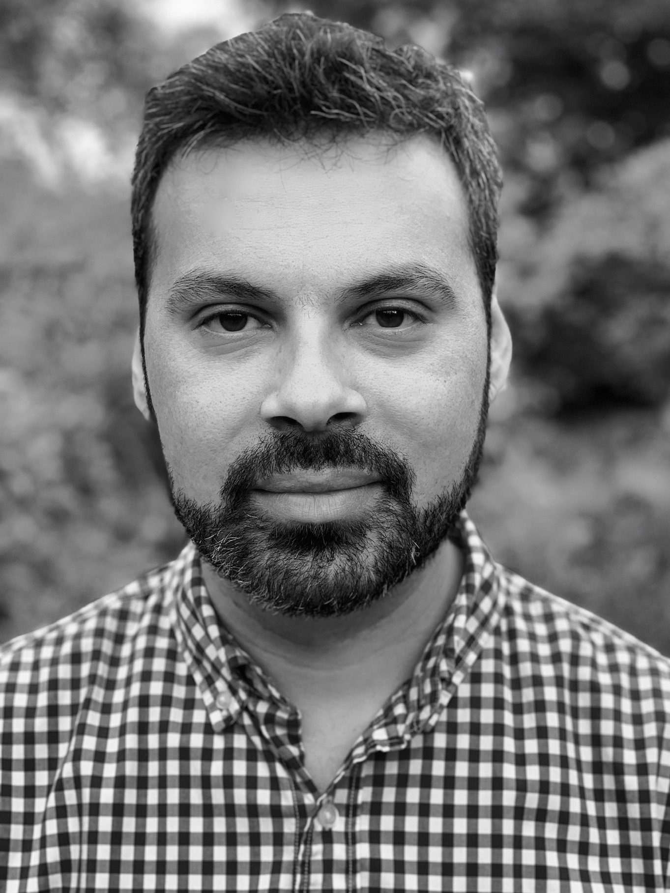

<!-- Hero Section: 60/40 split - Content left, Picture right -->
::: {.hero-section}
::: {.hero-content}

Innovative scientific leader with over 19 years of combined experience in academia and biotech, specializing in Cell and Molecular Biology with emphasis on Cell Therapy, RNA/cDNA technologies, and next-generation sequencing. Recently completed advanced certification in AI and Machine Learning for Data Science, gaining expertise in neural networks, deep learning frameworks, LLMs, and RAG systems.
Skilled in establishing and managing R&D projects across cell therapy and nucleic acid sequencing platforms, now enhanced by cutting-edge AI/ML capabilities for advanced data analysis and predictive modeling. Experienced in supporting process development and manufacturing to facilitate seamless translation of scientific ideas into healthcare solutions. Passionate about leading teams and transforming cell biology and genomic research into impactful biotechnology advancements through integration of molecular biology expertise with AI-driven approaches.
Strong technical expertise spanning wet-lab methodologies, bioinformatics, and machine learning, with focus on data-driven decision-making, stakeholder management, and leveraging AI tools to unlock insights from complex datasets.

:::

::: {.hero-image}
{width="300" alt="Rodrigo Grandy - Professional Photo"}

::: {.contact-links}
[](mailto:rodrigograndy@gmail.com){.contact-link target="_blank" title="Email"} 
[](https://www.linkedin.com/in/rodrigo-grandy){.contact-link target="_blank" title="LinkedIn"} 
[](https://github.com/rgrandym){.contact-link target="_blank" title="GitHub"} 
:::
:::
:::

<!-- Core Expertise - Full Width -->
::: {.core-expertise-section}
**Core Expertise**: Strategic R&D planning • Team leadership • iPSC-derived cell cultures • Hematopoietic stem cell differentiation • Genomics & bioinformatics • Process optimization • Quality control for cell-based products
:::

<!-- Featured Project Section -->
::: {.featured-section}
## Featured Projects

::: {.featured-project-card}
::: {.cell_therapy_project_card-content}
### Generation of Fully Matured Hematopoietic Stem Cells with iPSC: This should be the basecamp for iPSC-derived Immunotherapies.

Led a pioneering project focused on the generation of hematopoietic stem cells (HSCs) from induced pluripotent stem cells (iPSCs). Developed and optimized protocols for cell differentiation, ensuring high yield and purity of HSCs for therapeutic applications.

**Technologies**: iPSC Culture • Cell Differentiation • Flow Cytometry • Gene Editing • Stem Cell Biology

::: {.featured-actions}
[View Full Project](projects/genomic-qc-pipeline.qmd){.cta-button}
[View All Projects](projects.qmd){.cta-button}
:::
:::
:::

::: {.featured-project-card}
::: {.cell_therapy_project_card-content}
### Quality Control of Genetically Engineered iPSCs for Immunotherapies.

Led a pioneering project focused on the quality control of genetically engineered iPSCs. Developed and optimized protocols for the characterization and validation of iPSCs, ensuring their safety and efficacy for therapeutic applications.

**Technologies**: iPSC Culture • Cell Differentiation • Flow Cytometry • Gene Editing • Stem Cell Biology

::: {.featured-actions}
[View Full Project](projects/genomic-qc-pipeline.qmd){.cta-button}
[View All Projects](projects.qmd){.cta-button}
:::
:::
:::

::: {.featured-project-card}
::: {.cell_therapy_project_card-content}
### Development of CAR-T Cells from iPSCs for Cancer Immunotherapy.

Led a groundbreaking project focused on the development of CAR-T cells from induced pluripotent stem cells (iPSCs). Established protocols for the differentiation and engineering of iPSCs into CAR-T cells, enabling targeted cancer therapies.

**Technologies**: iPSC Culture • CAR-T Cell Engineering • Flow Cytometry • Gene Editing • Stem Cell Biology

::: {.featured-actions}
[View Full Project](projects/genomic-qc-pipeline.qmd){.cta-button}
[View All Projects](projects.qmd){.cta-button}
:::
:::
:::
:::