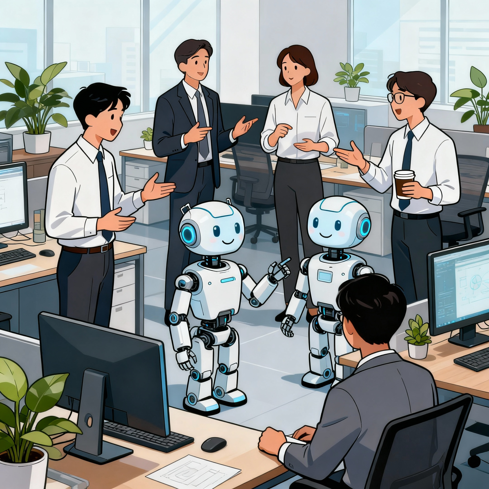

[← Back to Blogs](../../blog.qmd){.back-link}

---

```{=html}
<figure id="fig-1">
  <div style="text-align: center; margin-bottom: 1rem;">
    <div style="font-size: 20pt; font-weight: normal; color: #2c3e50;"></div>
  </div>
  <div style="display: flex; gap: 1.5rem; justify-content: center; flex-wrap: wrap;">
    
  </div>
  <figcaption>Figure 1: The cartoon illustrates the concept of AI as a tool for augmenting human capabilities, not replacing them. The AIs need constant supervision, guidance, and the human touch to ensure quality and accuracy.</figcaption>
</figure>
```


## The Study Everyone's Talking About (But Probably Misunderstanding)

Microsoft Research released a much-cited study analyzing 200,000 real user conversations to see which jobs are “most vulnerable” to AI [(The Article)](https://arxiv.org/pdf/2507.07935v2). The headlines wrote themselves: customer service, writers, interpreters are at risk, while “AI is coming for your job.” But if you actually read the study (as most in the media clearly have not), the real picture is much more complex, and frankly, less dramatic.

---

## High AI Exposure Does NOT Mean Job Elimination
The researchers created an “AI applicability score” for occupations (0.0–1.0), based on how often tasks are handled by AI and whether they’re marked “completed.” Unsurprisingly, this got quickly translated into “jobs at risk.”

However, the authors are explicit throughout: AI is not performing all activities of any occupation. Even for jobs with substantial overlap, AI completion rates are well below 100%, and the work supported is often only a subset, far from wholesale automation. This nuance, though central, is nearly absent from mainstream coverage.

As someone who lives and breathes AI tools: for coding, writing, brainstorming, and yes, even the occasional image, I must say that I agree with the study. Overall, it aligns with my daily experiences. A lot of usage, relative success, requiring a great deal of intervention. 

In general, I feel these tools are awesome....but very, very far from replacing anyone who knows what they’re doing. Behind the curtain, they’re basically just guessing at the next word, not thinking or understanding (despite what some people may want you to believe). I use them every day, and can tell you that I spend a lot of time sorting, debugging, verifying, and sometimes just deleting what they spew out.

## Task Completion ARE NOT equal to Correct or Useful Output

And here’s where the method falls over. The study tracks whether AI “finishes” a user’s task. But it does not count how often it gets things wrong. It doesn’t capture the time you waste fixing errors or the expertise needed to figure out if the answer is even remotely correct. 

To put it plainly: Imagine a sales rep making 100 calls a day but closing only 2 deals, lots of “completion,” very little success. That’s generous, even, compared to some AI outputs, and not, I am not considering writing emails or making a website with the exact same design once and again, I am talking about actual complex tasks. The irony is sometimes people don’t even realize the answer is wrong, until it’s too late (1, 2, to mention a few examples).

If you've used GitHub Copilot or any other LLM-based platform for coding, you know the reality: AI completes tasks constantly, but the output requires correction, verification, and expert review. Sometimes the bot even congratulates itself on a job not even close to well done. Studies put code error rates anywhere from 12% to nearly 50% (complexity matters), with security vulnerabilities in a quarter to a third of cases. Entire package names can just be made up. If you’re technical and attentive, your productivity still improves. If you just hope for the bot to give you the right answer, you are on track to be constantly disappointed and frustrated.

It’s not just coding. I once performed a little experiment and I asked an LLM to analyse and describe several charts for a report: initially I was impressed, all charts had been analysed and the words sounded polished. However, careful inspection revealed that the numbers were fantasy, most likely copied from its training, not my data. Sure, if you micromanage the prompt and spoon-feed context, and may be process one chart at a time, you might be able to get better results, which brings us back to the actual point of this article. With enough supervision, and expert guidance, these tools can produce useful output. But that invisible scaffolding is all human. **The study's methodology does not capture this reality.**

---

## Why Developers Aren’t Being Replaced

The “computer and mathematical” group scores a 0.30 for AI applicability, second only to clerical roles. But you don’t see the media panicking about developers any more. Why? Because the details get interesting: productivity studies on Copilot show professional devs accept under 23% of suggestions, while the other 77% need manual work or are tossed out. Code gets written faster, but the time to check, debug, and connect the pieces goes up. Turns out, “AI assistant” means “good at helping, mediocre at finishing the job.” Sound familiar?​

Other fields, writing, science, business, are seeing the same divide. Now, with a few prompts, you can whip up a nice email or standard report. But anything real, valuable, or nuanced still takes your judgment, and your effort. So yes: **jobs are changing, not disappearing. And if you’ve got expertise, you’re suddenly a lot more valuable.**

---

## The Study Measures Current Usage, Not Future Outcomes

A critical distinction: Microsoft's paper analyzes present-day patterns of AI usage, not organizational staffing, policy, or macroeconomic consequences. They can't predict which of the “AI-assisted” jobs a company will automate, outsource, or expand. All bold claims about inevitable job loss should be met with skepticism, the study itself says so.

Unless the big AI-development companies are hiding some secret AGI technology, that they are secretly selling to their big customers, there is no reason to believe that companies will be suddenly get rid of their human workforce in the near future.

This is crucial: **AI applicability is a technology question. Job displacement is an economic and policy question and the study answers only the first.** So, just keep that in mind when you see sensational headlines about "40 Jobs AI Will Replace."

And as a side note, have you wonder what would happen to the economy if 10-20% of the current workforce all of a sudden became unemployed? Who is buying all the wonderful products and services that these AIs would be producing?, who will pay for mortgages, rent, healthcare, insurance, buy new cars, phones, computers, netflix or spotify subscriptions? Just to mentioned a few things. All that does not make any sense economically. Universal Income? Ha, what a joke, if we can't even agree on the basics of healthcare for everyone.

---


## Where AI Actually Excels (And Why It Matters)

Don’t get me wrong, I love these tools, and when used right, they help a ton:

- Information gathering: Great at finding, summarizing, speed-reading (but prone to hallucination, so keep a close eye)
- Writing and editing: Drafts things fast, polishes prose (but needs human tone and fact-checking)
- Explaining concepts: Simplifies the complicated (but may miss nuances, so just triple-check the facts)
- Analyzing standard data: Fast at trends, not so hot with nuance or edge cases (human interpretation still key)
- Producing documentation: Useful, but again, it requires strong human review

However… creativity, context, strategic thinking, judgment, hands-on execution, hypothesis generation, stakeholder wrangling? You still need an expert, especially in messy real fields like Biology (AI applicability score: 0.16). Ask anyone who’s ever tried to automate “experimental design” or deep data interpretation via LLM)

---

## The Jobs Actually Under Pressure (And Why)

The study's highest-exposure occupations: Interpreters, customer service representatives, telemarketers, have something in common: they're already under economic pressure, and the work often involves lower barriers to entry and less specialized domain knowledge.

But that's an economic story, not an AI story. Companies have always sought to automate or outsource lower-margin work. AI is a tool that accelerates this trend, but it doesn't create the underlying pressure.


---

## The Bottom Line

The Microsoft study, despite its rigor, does not support the idea that AI is replacing skilled professionals. On the contrary, the professionals who can supervise, validate, and enhance AI outputs are more valuable than ever.

Both the data and my daily grind tell the same story: AI supercharges experts, but doesn’t replace them. If you know your field, these tools let you offload grunt work, so you can focus on the tricky, valuable, mission-critical stuff the models will mangle if left unsupervised. You’re not competing with AI; you’re directing it, checking it, and knowing where it falls flat.

Those who thrive? The domain experts, the supervisors, the relentless fact-checkers and synthesizers. The very people the best AI can only assist.

**That’s not job elimination. That’s transformation—powered by skill, judgment, and the ability to make machines work for you, as it should be (not the other way around).**


---

### Note on Sources

All findings and quotes referenced from Microsoft Research's "Working with AI: Measuring the Occupational Implications of Generative AI" (2025). [(The Article)](https://arxiv.org/pdf/2507.07935v2).


1.- https://fortune.com/2025/10/07/deloitte-ai-australia-government-report-hallucinations-technology-290000-refund/
2.- https://www.theguardian.com/australia-news/2025/oct/06/deloitte-to-pay-money-back-to-albanese-government-after-using-ai-in-440000-report