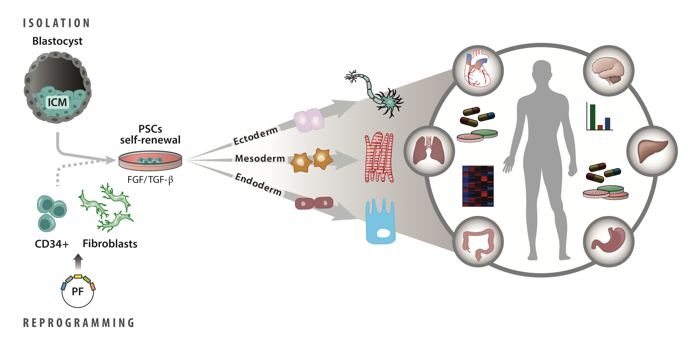
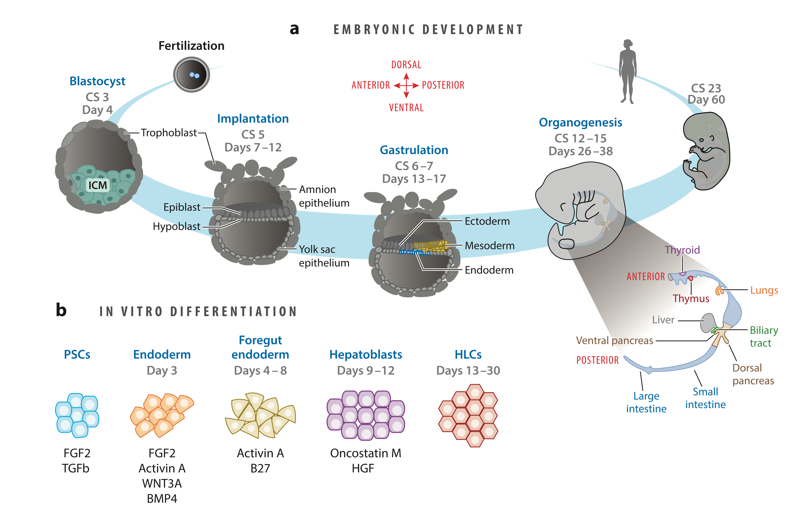

::: {.projects-landing-page}
Browse my portfolio of projects across key research areas. Each category showcases my skills and practical experience in data science, machine learning, and scientific innovation in biotechnology.
:::

```{=html}
<div class="quarto-listing quarto-listing-container-default">
<div class="list quarto-listing-default">

<!-- Cell Therapy -->
<div class="quarto-post image-right">
  <div class="thumbnail">
    <a href="projects/categories/cell-therapy.html">
      
    </a>
  </div>
  <div class="body">
    <h3 class="no-anchor listing-title">
      <a href="projects/categories/cell-therapy.html">Cell Therapy</a>
    </h3>
    <div class="listing-description">
      Advanced research in pluripotent stem cell culture and differentiation for R&D and manufacturing. I share my experience and points of view in specific areas related to the use of human iPSCs and hESCs for research and development of allogenic cell therapies and other stem cell-derived products.
    </div>
  </div>
</div>

<!-- Cell and Molecular Biology -->
<div class="quarto-post image-right">
  <div class="thumbnail">
    <a href="projects/categories/cell-molecular-biology.html">
      
    </a>
  </div>
  <div class="body">
    <h3 class="no-anchor listing-title">
      <a href="projects/categories/cell-molecular-biology.html">Cell and Molecular Biology</a>
    </h3>
    <div class="listing-description">
      This section highlights my research in cell and molecular biology, focusing on the mechanisms of cell differentiation, gene regulation, and the application of stem cell technologies in regenerative medicine.
    </div>
  </div>
</div>

<!-- Machine Learning & AI -->
<div class="quarto-post image-right">
  <div class="thumbnail">
    <a href="projects/categories/machine-learning-ai.html">
      
    </a>
  </div>
  <div class="body">
    <h3 class="no-anchor listing-title">
      <a href="projects/categories/machine-learning-ai.html">Machine Learning & AI</a>
    </h3>
    <div class="listing-description">
      Predictive modeling, statistical analysis, and artificial intelligence applications in education and data science. Featuring XGBoost models, neural networks, and advanced analytics.
    </div>
  </div>
</div>

</div>
</div>
```
