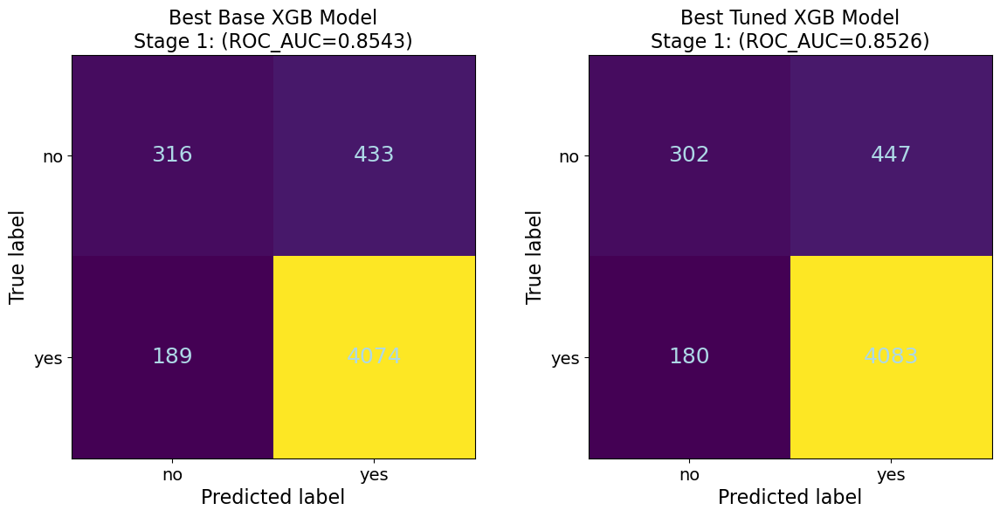
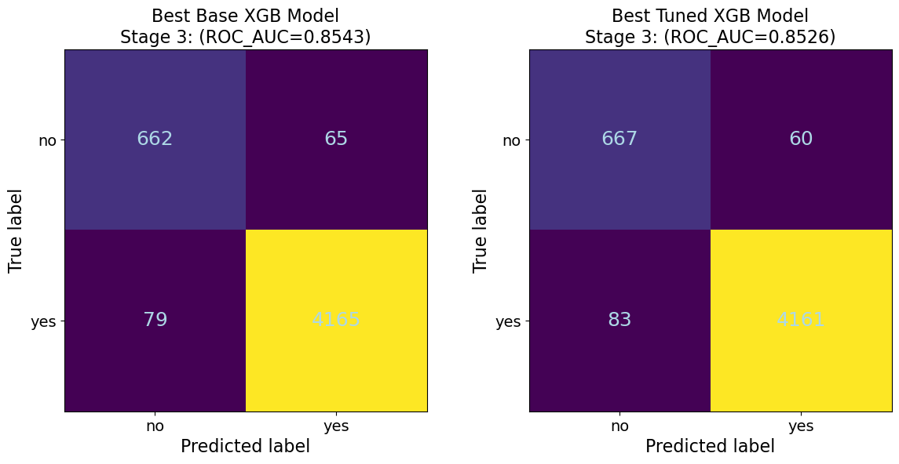
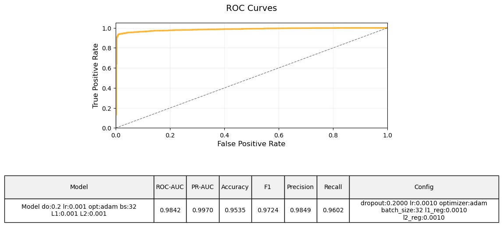
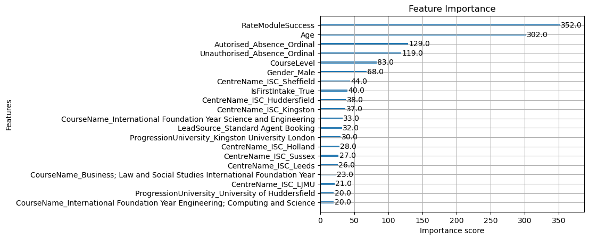

## Overviews

This project explores the application of supervised learning techniques to predict student dropout risk. Using a progressive dataset approach, we compare XGBoost (gradient-boosted decision trees) and Neural Networks for structured data analysis, demonstrating how predictive power improves with additional data layers.

## Problem

Educational institutions face challenges in identifying at-risk students early enough to intervene effectively. Traditional methods often rely on reactive indicators rather than predictive analytics. Understanding which factors most strongly predict dropout risk—and at what stage of a student's journey—is crucial for developing effective retention programs.

## Approach

All work in this project was implemented in Python 3.12.3. Datasets underwent preprocessing using pandas (v2.2.3). Irrelevant columns and high cardinality features were removed. "Date of Birth" was transformed into "Age." Columns with >50% missing data were dropped. Ordinal encoding was applied to "CourseLevel" using scikit-learn (v1.6.1) (Pedregosa et al., 2011). Absence counts were binned into categories. One-hot encoding was used for other categorical features. Missing values were addressed by removing observations when the fraction of NAs was above 2%. For Stage 3, "RateModuleSuccess" was computed. NumPy (v1.26.4) was used for numerical computations.

### Dataset Progression

We developed a dropout prediction system using three progressive datasets:

1. **Stage 1**: Core student profiles (demographics, course information)
2. **Stage 2**: Engagement metrics (authorized/unauthorized absences)  
3. **Stage 3**: Academic performance (module pass/fail rates)

### Methodology

- **Preprocessing**: Data encoding, scaling, and feature engineering
- **Models**: XGBoost and Neural Networks with hyperparameter tuning
- **Evaluation**: ROC-AUC, F1-score, precision-recall metrics
- **Comparison**: Performance analysis across all three data stages


## Results

For simplicity, only the stage 3 analysis and results are shown as examples. Detailed performance comparisons for both models across all stages are provided in the tables below.


```{python}
#| label: tbl-xgb_comp
#| code-fold: true
#| code-summary: "Load and display XGBoost performance data"
#| tbl-cap: 'XGBoost Model Performance before and after hyperparameter tuning'
#| tbl-cap-location: bottom
#| tbl-align: left  # Left-aligns the caption
#| output: asis

import pandas as pd
# Load and display data (path relative to project root)
xgb_s1s2s3 = pd.read_csv('../assets/student_dropout/figures/full_comparison_XGB_s1s2s3.csv')

# Define the decimal precision
decimal_places = 3
# Format numeric columns
numeric_cols = xgb_s1s2s3.select_dtypes(include=['float64', 'int64']).columns
xgb_s1s2s3[numeric_cols] = xgb_s1s2s3[numeric_cols].round(decimal_places)

# Print as markdown table with improved formatting
print(xgb_s1s2s3.to_markdown(tablefmt="pipe", index=False, stralign="center", numalign="center"))

```
```{python}
#| label: tbl-NN_comparison
#| code-fold: true
#| code-summary: "Load and display Neural Network performance data"
#| tbl-cap: 'Neural Network Performance before and after hyperparameter tuning'
#| tbl-cap-location: bottom
#| tbl-align: left  # Left-aligns the caption
#| output: asis

import pandas as pd
# Load and display data
nn_s1s2s3 = pd.read_csv('../assets/student_dropout/figures/comparison_neural_networks_all_stages.csv')

# Define the decimal precision
decimal_places = 3
# Format numeric columns
numeric_cols = nn_s1s2s3.select_dtypes(include=['float64', 'int64']).columns
nn_s1s2s3[numeric_cols] = nn_s1s2s3[numeric_cols].round(decimal_places)

# Print as markdown table with improved formatting
print(nn_s1s2s3.to_markdown(tablefmt="pipe", index=False, stralign="center", numalign="center"))


```


### XGBoost Model Development: 

XGBoost (v3.0.1) models were initially trained without tuning (Chen & Guestrin, 2016). Hyperparameter tuning used GridSearchCV with 3-fold cross-validation, optimizing for ROC AUC. Key hyperparameters included learning_rate, max_depth, and n_estimators. 


###  Confusion Matrices Across Stages

::: {.figure-panel}
::: {.figure-item}
**A) Stage 1 - Demographics Only**

{width="80%"}
:::

::: {.figure-item}
**B) Stage 2 - Demographics + Engagement**

{width="70%"}
:::

::: {.figure-item}
**C) Stage 3 - Demographics + Engagement + Performance**

{width="70%"}
:::
:::

*Figure: Confusion Matrices for the best XGBoost Models at each stage showing progressive improvement in prediction accuracy.*


### Neural Network Model Development:
Neural networks were built using TensorFlow (v2.19.0) and Keras (v3.10.0) with 1-3 hidden layers (16-128 units each), ReLU activation, and Softmax output. Dropout (0.2-0.3) and L1/L2 regularization were applied. Models used Adam or RMSProp optimizers (learning rate 0.01-0.001) and categorical sparse crossentropy loss. Early stopping (patience=3) was implemented. Deterministic batch shuffling ensured reproducibility. Batch sizes of 16 and 32 were tested. Model complexity was reduced to prevent overfitting and improve generalization.
## Key Results

### Model Performance

**XGBoost Performance:**
- Stage 1 (Demographics): ROC-AUC = 0.82
- Stage 2 (+ Engagement): ROC-AUC = 0.85
- Stage 3 (+ Performance): ROC-AUC = 0.94

**Neural Network Performance:**
- Stage 1: ROC-AUC = 0.80
- Stage 2: ROC-AUC = 0.83
- Stage 3: ROC-AUC = 0.92




### Feature Importance

The most predictive features for student dropout included:

- Number of curricular units credited in 1st/2nd semester
- Tuition fees up-to-date status
- Previous qualification grade
- Admission grade
- Age at enrollment



### Model Comparison


## Technologies

- **Python 3.12**: Core programming language
- **XGBoost**: Gradient boosting framework
- **TensorFlow/Keras**: Neural network implementation
- **scikit-learn**: Model evaluation and preprocessing
- **pandas & numpy**: Data manipulation
- **matplotlib & seaborn**: Data visualization

## Key Insights

1. **Data Quality Matters**: Academic performance metrics (Stage 3) dramatically improved model accuracy compared to demographics alone
2. **Model Selection**: XGBoost consistently outperformed Neural Networks across all stages, likely due to the structured nature of educational data
3. **Early Detection**: Even with limited data (Stage 1), models achieved reasonable predictive power (AUC > 0.80)
4. **Feature Engineering**: Proper encoding and scaling were crucial for model performance
5. **Interpretability**: XGBoost's feature importance provided actionable insights for intervention strategies

## Outcomes

- Successfully predicted student dropout with 94% AUC using complete dataset
- Identified key risk factors enabling early intervention
- Demonstrated progressive improvement with additional data layers
- Established methodology for educational data analysis
- Created interpretable model for stakeholder decision-making

This project demonstrates how machine learning can transform educational outcomes by enabling data-driven, proactive student support systems.

## Resources


[← Back to Projects](../projects.qmd){.back-link}
