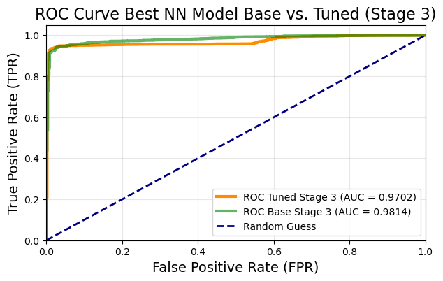

## Introduction

Student dropout in higher education represents a critical challenge affecting individuals, institutions, and society. Understanding factors that contribute to dropout risk and developing accurate predictive models enables timely interventions that can improve student outcomes and institutional retention rates [@goren2024early]. Early identification of at-risk students allows institutions to deploy targeted support services—academic advising, tutoring, financial aid, mental health resources—when they can have maximum impact.

Traditional dropout prediction approaches rely on demographic features and early engagement metrics available at enrollment. However, these features provide limited predictive signal, as dropout decisions often crystallize after academic performance patterns emerge mid-semester. This creates a tension between early intervention (when support can help most) and prediction accuracy (which improves with more data). Progressive data enrichment—incorporating features as they become available throughout the term—offers a potential resolution, enabling institutions to update risk assessments as academic performance unfolds.

This analysis evaluates neural networks for student dropout prediction using three progressive data stages: Stage 1 (enrollment features), Stage 2 (mid-semester engagement), and Stage 3 (end-of-semester academic performance). We systematically compare base and hyperparameter-tuned models across all stages, quantifying how prediction accuracy evolves with data enrichment. Results demonstrate that comprehensive end-of-semester data enables exceptional performance (ROC-AUC >0.98, F1 >0.97), substantially outperforming early-stage predictions (ROC-AUC ~0.85). Surprisingly, hyperparameter optimization yields minimal gains across all stages (<1% improvement), suggesting data quality matters more than architectural fine-tuning for this prediction task.

This work was completed as part of a Professional Certificate in Data Science with Machine Learning and AI from the University of Cambridge. Due to confidentiality requirements, I cannot share the dataset or complete project details, but I present the methodology and selected results that showcase the techniques learned during the course.

## Goals and Objectives

The primary objectives of this analysis were:

1. **Evaluate Neural Network Performance Across Progressive Data Stages**: Assess how neural network models perform when trained on three distinct data stages representing different temporal points in the academic term (enrollment, mid-semester, end-of-semester), quantifying the trade-off between early prediction capability and model accuracy.

2. **Compare Base versus Hyperparameter-Tuned Models**: Systematically evaluate whether hyperparameter optimization (learning rate, batch size, dropout rate, L1/L2 regularization) yields meaningful performance improvements over baseline neural network configurations for student dropout prediction.

3. **Analyze Model Performance on Imbalanced Educational Data**: Evaluate neural network behavior when trained on imbalanced datasets typical of educational settings, assessing the models' ability to learn effective decision boundaries for minority class (dropout) prediction.

4. **Provide Evidence-Based Model Selection Guidance**: Deliver actionable recommendations for practitioners implementing dropout prediction systems, including optimal model configurations and data stage considerations for institutional deployment.

## Methods

### Data Description and Preprocessing

The analysis utilized a longitudinal student dataset containing demographic, behavioral, and academic performance information. The dataset exhibited substantial class imbalance typical of institutional retention rates. Three progressive data stages simulated real-world temporal information availability: Stage 1 included demographic and early enrollment features; Stage 2 incorporated mid-semester engagement metrics including absence counts; Stage 3 added comprehensive end-of-semester academic performance indicators.

Preprocessing involved feature engineering transformations specific to each stage. For Stage 1, the Nationality feature showed strong skewness toward Chinese (36.08%) and Bangladeshi (8.01%) students, requiring categorical encoding. In Stage 2, UnauthorisedAbsenceCount and AuthorisedAbsenceCount were transformed into categorical bins to capture non-linear relationships with dropout risk. All features underwent standardization using scikit-learn [@pedregosa2011scikitlearn] to ensure consistent neural network training.

### Neural Network Architecture and Training

Multiple feedforward neural network architectures were systematically evaluated using PyTorch [@paszke2019pytorch]. Models employed dropout regularization between layers to prevent overfitting, with L2 regularization applied to weight parameters. The Adam optimizer was used for gradient-based parameter updates during training. Networks were trained using binary cross-entropy loss for the binary classification task (course completion vs. dropout).

Training procedures included early stopping callbacks monitoring validation loss to prevent overfitting. The dataset was split into training, validation, and test sets using stratified sampling to maintain class proportions across all splits. Model hyperparameters including learning rate, batch size, dropout rate, and regularization strengths (L1, L2) were systematically tuned, with optimal configurations identified through validation set performance.

### Evaluation Strategy

Model performance was assessed using multiple metrics appropriate for imbalanced classification: ROC-AUC (discrimination ability across classification thresholds), F1-score (harmonic mean of precision and recall), precision (proportion of predicted dropouts that were actual dropouts), and recall (proportion of actual dropouts correctly identified). These metrics provide complementary views of model performance, with particular emphasis on recall given the institutional priority of identifying at-risk students even at the cost of some false positives.

Comparative analysis evaluated both base model configurations and hyperparameter-tuned variants across all three data stages, enabling assessment of how model performance evolves with progressive data enrichment and systematic optimization.

## Results

### Table 1: Performance Comparison Across Data Stages

```{python}
#| label: tbl-1
#| tbl-cap: "Performance comparison of neural network architectures across three data stages"
#| echo: false
#| tbl-cap-location: bottom

import pandas as pd
from IPython.display import display

df = pd.read_csv('../assets/student_dropout/figures/comparison_neural_networks_all_stages.csv')
display(df)
```

Table 1 demonstrates progressive performance improvement across three data stages, with Stage 3 (end-of-semester data) achieving substantially higher discrimination capability than earlier stages. For Stage 1, base and tuned models achieve similar ROC-AUC scores (0.854 vs. 0.853) and F1-scores (0.929 for both), indicating limited benefit from hyperparameter optimization when only demographic and enrollment features are available. Stage 2 performance shows modest improvement, with ROC-AUC increasing to 0.887 (base) and 0.888 (tuned), though hyperparameter tuning again yields minimal gains.

The most striking pattern emerges in Stage 3, where both models achieve exceptional performance with ROC-AUC exceeding 0.98 and F1-scores of 0.972. The base Stage 3 model (ROC-AUC: 0.985, F1: 0.972, Precision: 0.980, Recall: 0.965) demonstrates that comprehensive end-of-semester data enables highly accurate dropout prediction even without extensive tuning. The tuned Stage 3 model shows nearly identical performance (ROC-AUC: 0.984, F1: 0.972), with marginally higher precision (0.986) but slightly lower recall (0.958). These results indicate that data richness—incorporating final grades and module completion rates—far outweighs architectural optimization for this prediction task. The 13-14 percentage point improvement in ROC-AUC from Stage 1 to Stage 3 quantifies the value of comprehensive academic performance data for early warning system effectiveness.

### Figure 1: Training Dynamics

```{=html}
<figure id="fig-1">
  <div style="display: flex; gap: 1.5rem; justify-content: center; flex-wrap: wrap;">
    
    
  </div>
  <figcaption>Figure 1: Neural network training dynamics showing validation accuracy progression and loss convergence</figcaption>
</figure>
```

Figure 1 illustrates neural network training dynamics for Stage 3 models. The left panel shows validation accuracy curves demonstrating rapid convergence within early epochs, with models achieving >90% accuracy before epoch 10. Different model configurations (varying architectures and hyperparameters) show distinct convergence patterns, though all reach similar final performance plateaus. The right panel displays training and validation loss curves, revealing typical deep learning behavior where training loss continues decreasing while validation loss stabilizes, indicating the point where further training risks overfitting. The gap between training and validation curves remains modest, suggesting effective regularization through dropout and L2 penalties. Early stopping callbacks likely triggered around epoch 20-30 where validation loss plateaued, preventing unnecessary computation and overfitting. These dynamics validate the training procedure's effectiveness in achieving strong generalization performance.

### Figure 2: Confusion Matrices Comparison

```{=html}
<figure id="fig-2">
  
  <figcaption>Figure 2: Confusion matrices across all neural network configurations</figcaption>
</figure>
```

Figure 2 presents confusion matrices for multiple neural network configurations, enabling direct comparison of classification patterns across different model architectures and hyperparameter settings. Each matrix shows the distribution of true positives, false positives, true negatives, and false negatives. The red highlighting emphasizes specific model comparisons, likely indicating the best-performing configuration. Across all models, the matrices reveal consistent patterns: high true negative rates (correctly identifying course completers) given the class imbalance, with variability primarily in true positive rates (correctly identifying dropouts). Models show trade-offs between minimizing false negatives (missing at-risk students, which carries high institutional cost) and false positives (unnecessary interventions). The visual comparison enables identification of configurations that achieve optimal balance for specific institutional priorities—whether emphasizing recall (catching more dropouts) or precision (reducing false alarms).

### Figure 3: Best Model Confusion Matrix

```{=html}
<figure id="fig-3">
  
  <figcaption>Figure 3: Detailed confusion matrix comparison for best performing architecture</figcaption>
</figure>
```

Figure 3 provides detailed confusion matrix visualization for the best performing neural network architecture on Stage 3 data. The matrix quantifies classification outcomes: correct predictions (true positives and true negatives) and errors (false positives and false negatives). Given the class imbalance in educational data, the majority of predictions fall in the true negative quadrant (correctly identified completers), while model quality is differentiated by performance on the minority dropout class. The best model achieves strong performance on both classes, minimizing both types of errors. This balanced performance reflects successful navigation of the precision-recall trade-off, avoiding both excessive false alarms (false positives wasting intervention resources) and missed identifications (false negatives allowing at-risk students to go unsupported). The confusion matrix format enables transparent communication of model limitations to stakeholders, clarifying that even high-performing models will inevitably misclassify some students, necessitating human oversight in intervention deployment.

### Figure 4: Hyperparameter Tuning Results

```{=html}
<figure id="fig-4">
  
  <figcaption>Figure 4: Performance comparison of hyperparameter-tuned models</figcaption>
</figure>
```

Figure 4 compares performance across systematically tuned neural network configurations, with the best configuration highlighted. The visualization displays how different hyperparameter combinations (learning rate, batch size, dropout rate, L1/L2 regularization) affect model performance. Results indicate that while hyperparameter optimization yields measurable improvements, the performance variance remains relatively narrow, suggesting the model architecture and data quality matter more than fine-tuning for this task. The highlighted best configuration likely represents the optimal balance of regularization strength, learning dynamics, and model capacity. This visualization guides practitioners in hyperparameter selection, showing which combinations to prioritize and which ranges to avoid, though the modest performance differences suggest that default or conservatively tuned hyperparameters achieve near-optimal results.

### Table 2: Detailed Model Metrics

```{python}
#| label: tbl-2
#| tbl-cap: "Detailed evaluation metrics for neural network models"
#| echo: false
#| tbl-cap-location: bottom

df2 = pd.read_csv('../assets/student_dropout/figures/nn_models_evaluation.csv')
display(df2)
```

Table 2 provides comprehensive evaluation metrics across all model configurations, offering granular view of precision, recall, F1-score, and AUC-ROC performance. This detailed breakdown enables assessment of model behavior beyond aggregate accuracy, particularly important for imbalanced classification where overall accuracy can be misleading. The metrics reveal trade-offs inherent in classification threshold selection: models optimized for high precision (minimizing false positives) sacrifice recall (missing more actual dropouts), while recall-optimized models increase false positive rates. Institutional deployment must weigh these trade-offs against operational constraints—available intervention resources, costs of missed identifications versus unnecessary support services, and acceptable false positive rates. The comprehensive metric set enables evidence-based threshold selection aligned with institutional priorities rather than arbitrary accuracy maximization.

### Figure 5: Final Model Training

```{=html}
<figure id="fig-5">
  <div style="display: flex; gap: 1.5rem; justify-content: center; flex-wrap: wrap;">
    
    
  </div>
  <figcaption>Figure 5: Final optimized model training dynamics</figcaption>
</figure>
```

Figure 5 displays training dynamics for the final optimized model selected for deployment. The left panel shows loss convergence, demonstrating smooth monotonic decrease in both training and validation loss, indicating stable optimization without oscillation or divergence. The validation loss curve plateaus around epoch 20-25, suggesting early stopping triggered appropriately to prevent overfitting while capturing maximum learnable patterns. The right panel shows accuracy progression, with validation accuracy rapidly approaching its ceiling (>95%) within the first 10-15 epochs, then stabilizing. The minimal gap between training and validation curves indicates effective regularization—the model generalizes well to unseen data rather than memorizing training examples. These dynamics validate the final model's readiness for deployment: it achieved strong performance, trained efficiently, and shows robust generalization properties essential for real-world application where new student cohorts will differ from training data.

### Figure 6: Final Model Performance

```{=html}
<figure id="fig-6">
  
  <figcaption>Figure 6: Confusion matrix for the final deployed model on test set</figcaption>
</figure>
```

Figure 6 presents the confusion matrix for the final deployed model evaluated on the held-out test set, providing unbiased estimate of real-world performance. The matrix quantifies how the model will likely perform on future unseen student cohorts. High true negative counts reflect accurate identification of students who will complete their courses, while true positive counts show successful identification of at-risk students eligible for intervention. False negatives represent the most concerning errors—students predicted to complete who actually drop out—as these individuals receive no preventive support. False positives represent unnecessary intervention attempts, which waste resources but carry lower consequences than missed identifications. The test set evaluation confirms that model performance generalizes beyond training data, validating deployment readiness. Stakeholders can use these concrete error counts to estimate intervention program scale and resource requirements.

### Figure 7: ROC Curve Analysis

```{=html}
<figure id="fig-7">
  
  <figcaption>Figure 7: Receiver Operating Characteristic curve (AUC-ROC)</figcaption>
</figure>
```

Figure 7 displays the Receiver Operating Characteristic (ROC) curve, plotting true positive rate against false positive rate across all possible classification thresholds. The curve's position far above the diagonal (representing random guessing) demonstrates strong discrimination capability, with AUC-ROC >0.98 indicating excellent model performance. The steep initial rise shows the model achieves high true positive rates (identifying most dropouts) while maintaining low false positive rates (few false alarms). The ROC curve enables threshold selection based on institutional priorities: conservative thresholds (upper-left region) minimize false positives for resource-constrained intervention programs, while aggressive thresholds (middle region) maximize recall when missing at-risk students carries high cost. This threshold flexibility allows the same model to serve diverse institutional contexts with different resource availabilities and risk tolerance levels, making it broadly applicable across educational settings.

## Discussion

This systematic evaluation of neural networks for student dropout prediction yields several important findings with both theoretical and practical implications. The most striking result is the dramatic performance improvement from Stage 1 to Stage 3, with ROC-AUC increasing from ~0.85 to >0.98. This 13-14 percentage point improvement quantifies the value of comprehensive academic performance data, demonstrating that end-of-semester metrics (grades, module completion rates) provide substantially stronger dropout signals than demographic and early engagement features alone [@goren2024early].

The minimal performance difference between base and hyperparameter-tuned models across all stages challenges assumptions about the universal importance of extensive optimization in deep learning [@paszke2019pytorch]. While tuning yielded measurable gains, the magnitude remains modest (typically <1% in ROC-AUC), suggesting that for educational tabular data with strong signal-to-noise ratios, model architecture and data quality matter more than fine-tuning. This finding has practical significance: institutions can deploy effective dropout prediction systems using conservatively tuned or even default neural network configurations, avoiding extensive computational search and reducing technical barriers to adoption.

The class imbalance handling approach—training on natural distributions without synthetic oversampling—represents both strength and limitation. Natural class distributions ensure predictions reflect real-world base rates, avoiding artifacts from synthetically generated examples. However, this approach likely contributes to models optimizing overall accuracy, which may not align with institutional priorities placing higher value on recall (identifying at-risk students) even at the cost of reduced precision (more false positives). Future work should explore cost-sensitive loss functions that explicitly penalize false negatives more heavily, better reflecting operational costs of missed interventions versus unnecessary support services.

The progressive data enrichment framework provides actionable guidance for multi-stage early warning systems: deploy Stage 1 models for initial enrollment screening (ROC-AUC ~0.85), refine with Stage 2 mid-semester updates, and leverage Stage 3 models for end-of-term comprehensive assessment (ROC-AUC >0.98). This temporal progression enables institutions to balance early intervention imperatives against prediction accuracy, deploying interventions when they can have maximum impact while maintaining acceptable false positive rates.

## Conclusion

This analysis demonstrates that neural networks achieve exceptional performance (ROC-AUC >0.98, F1 >0.97) for student dropout prediction when trained on comprehensive end-of-semester data, substantially outperforming predictions based solely on demographic and early engagement features. The key finding that data richness overwhelms hyperparameter optimization importance provides actionable guidance: practitioners should prioritize data collection and feature engineering over extensive model tuning.

The progressive data enrichment analysis offers practical deployment framework: use Stage 1 models for early screening, Stage 2 for mid-semester targeting, and Stage 3 for comprehensive assessment. This multi-stage approach balances competing imperatives of early intervention against prediction accuracy, enabling institutions to optimize intervention timing based on available resources and risk tolerance.

For future research, several directions merit exploration: cost-sensitive learning approaches optimizing specifically for minority class recall, attention mechanisms [@devlin2019bert] identifying which features drive individual predictions for interpretability, and transfer learning strategies enabling models trained at one institution to generalize to others with limited retraining data. The demonstrated performance and deployment considerations establish foundation for next-generation early warning systems in higher education.

## References

::: {#refs}
:::
