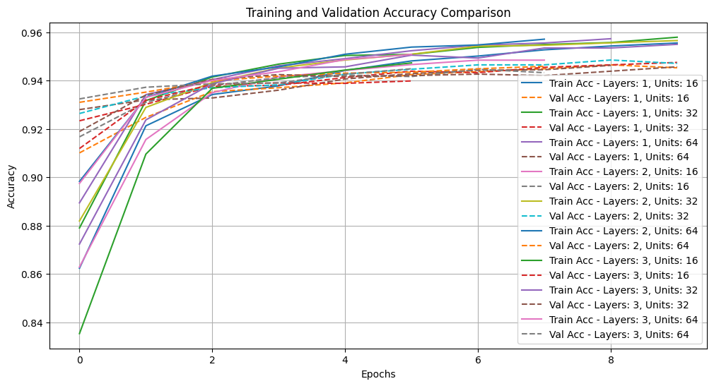
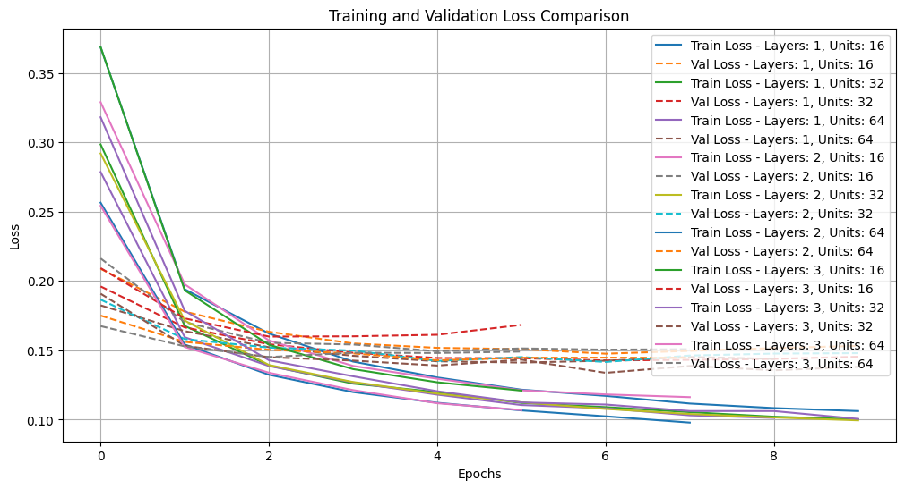
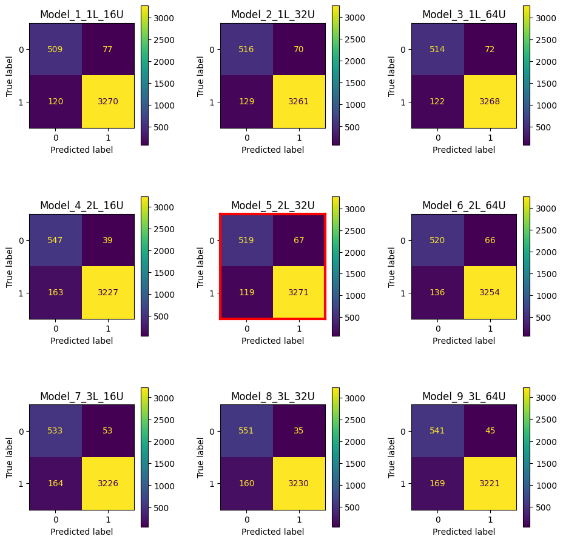
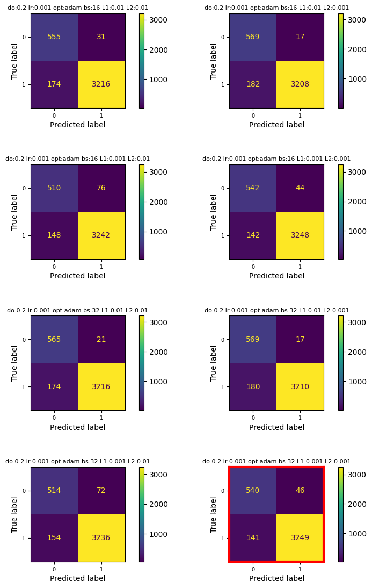
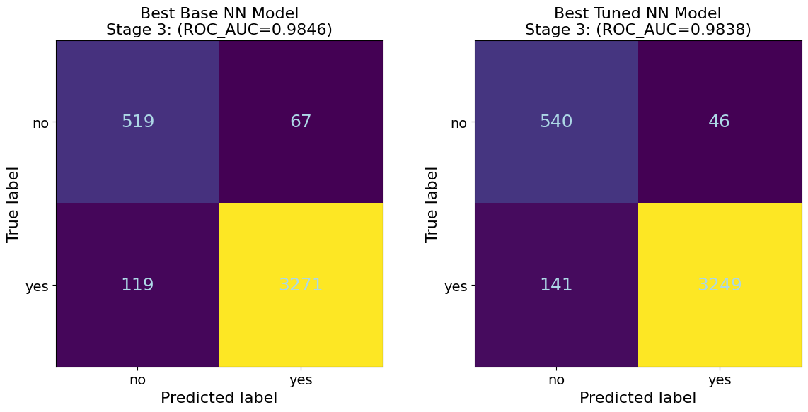
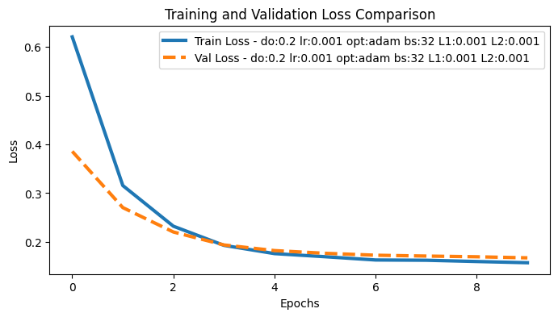
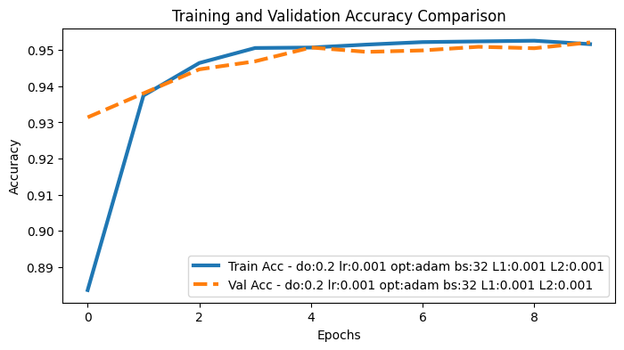
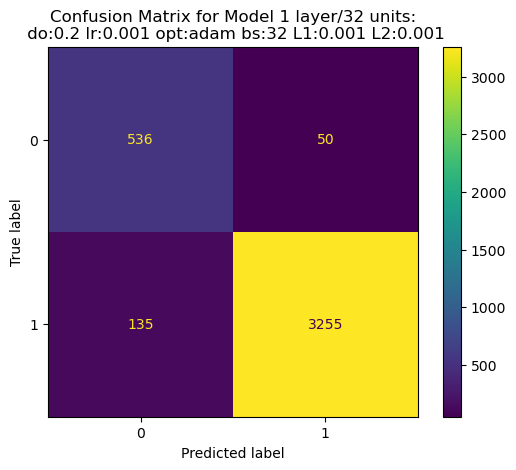

[← Back to Machine Learning Projects](categories/machine-learning-ai.qmd){.back-link}

## Introduction

Student dropout in higher education represents a critical challenge affecting individuals, institutions, and society. Understanding factors that contribute to dropout risk and developing accurate predictive models enables timely interventions that can improve student outcomes and institutional retention rates [@goren2024early]. Early identification of at-risk students allows institutions to deploy targeted support services, academic advising, tutoring, financial aid, mental health resources, when they can have maximum impact.

Traditional dropout prediction approaches rely on demographic features and early engagement metrics available at enrollment. However, these features provide limited predictive signal, as dropout decisions often crystallize after academic performance patterns emerge mid-semester. This creates a tension between early intervention (when support can help most) and prediction accuracy (which improves with more data). Progressive data enrichment, incorporating features as they become available throughout the term, offers a potential resolution, enabling institutions to update risk assessments as academic performance unfolds.

This analysis evaluates neural networks for student dropout prediction using three progressive data stages: Stage 1 (enrollment features), Stage 2 (mid-semester engagement), and Stage 3 (end-of-semester academic performance). We systematically compare base and hyperparameter-tuned models across all stages, quantifying how prediction accuracy evolves with data enrichment. Results demonstrate that comprehensive end-of-semester data enables exceptional performance (ROC-AUC >0.98, F1 >0.97), substantially outperforming early-stage predictions (ROC-AUC ~0.85). Surprisingly, hyperparameter optimization yields minimal gains across all stages (<1% improvement), suggesting data quality matters more than architectural fine-tuning for this prediction task.

This work was completed as part of a Professional Certificate in Data Science with Machine Learning and AI from the University of Cambridge. Due to confidentiality requirements, I cannot share the dataset or complete project details, but I present the methodology and selected results that showcase the techniques learned during the course.

## Goals and Objectives
  
Here are the primary objectives for the entire project, however I will discuss on selected aspects of stage 3 data:

1. **Evaluate Neural Network Performance Across Progressive Data Stages**: Assess how neural network models perform when trained on three distinct data stages representing different temporal points in the academic term (enrollment, mid-semester, end-of-semester), quantifying the trade-off between early prediction capability and model accuracy.

2. **Compare Base versus Hyperparameter-Tuned Models**: Systematically evaluate whether hyperparameter optimization (learning rate, batch size, dropout rate, L1/L2 regularization) yields meaningful performance improvements over baseline neural network configurations for student dropout prediction.

3. **Analyze Model Performance on Imbalanced Educational Data**: Evaluate neural network behavior when trained on imbalanced datasets typical of educational settings, assessing the models' ability to learn effective decision boundaries for minority class (dropout) prediction.

4. **Provide Evidence-Based Model Selection Guidance**: Deliver actionable recommendations for practitioners implementing dropout prediction systems, including optimal model configurations and data stage considerations for institutional deployment.

## Methods

### Data Description and Preprocessing

The analysis utilized a longitudinal student dataset containing demographic, behavioral, and academic performance information. The dataset exhibited substantial class imbalance typical of institutional retention rates. Three progressive data stages simulated real-world temporal information availability: Stage 1 included demographic and early enrollment features; Stage 2 incorporated mid-semester engagement metrics including absence counts; Stage 3 added comprehensive end-of-semester academic performance indicators.

Preprocessing involved feature engineering transformations specific to each stage. For all stages high-cardinality features (>200 unique values) including HomeState, HomeCity, and ProgressionDegree were removed to prevent overfitting and reduce dimensionality; DateOfBirth was converted to Age for improved feature interpretability. Critically, Stage 3 introduced academic performance metrics (AssessedModules, PassedModules, FailedModules) which were engineered into a composite feature RateModuleSuccess calculated as (PassedModules - FailedModules) / AssessedModules, capturing student success trajectory more parsimoniously than individual module counts. The Nationality feature was dropped from Stage 3 analysis due to extreme class imbalance. Features with >50% missing values were removed, and rows with missing absence category values were excluded given their small proportion. Categorical features underwent one-hot encoding, while ordinal features (CourseLevel, absence categories) received ordinal encoding. All features underwent standardization using scikit-learn [@pedregosa2011scikitlearn] to ensure consistent neural network training.

### Neural Network Architecture and Training

Multiple feedforward neural network architectures were systematically evaluated using TensorFlow/Keras [@abadi2016tensorflow]. The implementation prioritized reproducibility through deterministic operations, with fixed random seeds across all randomness sources (Python, NumPy, TensorFlow) and enabled TensorFlow's experimental deterministic operations mode. This ensures identical results across repeated runs, critical for fair model comparisons.

The dataset underwent hierarchical splitting into training (64%), validation (20%), and test (16%) sets using stratified random sampling to preserve class proportions across splits. Features were standardized using scikit-learn's StandardScaler fitted exclusively on training data, with the same transformation applied to validation and test sets to prevent data leakage. This preprocessing pipeline ensures models encounter data distributions representative of real-world deployment scenarios.

```{python}
#| echo: true
#| eval: false
#| code-fold: false
#| code-overflow: wrap

# Split the data into features and target variable
X_s3 = df3_filled.drop(columns=['CompletedCourse_Yes'], axis=1, inplace=False)
y_s3 = df3_filled['CompletedCourse_Yes']
# Display the first few rows of the features and target variable
display(X_s3.head())  
```

```{python}
#| echo: true
#| eval: false
#| code-fold: false
#| code-overflow: wrap

# Split the data into training and validation sets
X_train_s3, X_val_s3, y_train_s3, y_val_s3 = train_test_split(X_s3, y_s3, test_size=0.2, random_state=42)
# Split the training data into training and test sets
X_train_s3, X_test_s3, y_train_s3, y_test_s3 = train_test_split(X_train_s3, y_train_s3, test_size=0.2, random_state=42)

# Display the shapes of the training, validation, and test sets
print("Training set shape:", X_train_s3.shape, y_train_s3.shape)
print("Validation set shape:", X_val_s3.shape, y_val_s3.shape)
print("Test set shape:", X_test_s3.shape, y_test_s3.shape)
# Check the distribution of the target variable in the training set
print("Training set target variable distribution:")
print(y_train_s3.value_counts(normalize=True))
# Check the distribution of the target variable in the validation set
print("Validation set target variable distribution:")
print(y_val_s3.value_counts(normalize=True))
# Check the distribution of the target variable in the test set
print("Test set target variable distribution:")
print(y_test_s3.value_counts(normalize=True))
```

```{python}
#| echo: true
#| eval: false
#| code-fold: false
#| code-overflow: wrap

# Scale the data S3
scaler = StandardScaler()
X_train_scaled_s3 = scaler.fit_transform(X_train_s3)
X_val_scaled_s3 = scaler.transform(X_val_s3)
X_test_scaled_s3 = scaler.transform(X_test_s3)
```


A comprehensive architecture search evaluated nine baseline configurations spanning 1-3 layers and 16-64 units per layer, systematically exploring model capacity across different complexity levels. Each architecture was implemented as a Sequential model with dense (fully-connected) layers using ReLU activation, dropout regularization (rate=0.2) between layers, and a final softmax output layer for binary classification. Models employed Glorot uniform weight initialization for stable gradient flow and were compiled with the Adam optimizer (learning rate=0.001) and sparse categorical cross-entropy loss appropriate for multi-class formulation of the binary problem.

Training procedures incorporated early stopping callbacks monitoring validation loss with patience=3 epochs, automatically halting training when validation performance plateaued and restoring weights from the best epoch. This prevents overfitting while maximizing learning from available training data. All models trained for maximum 50 epochs with batch size 32, balancing computational efficiency against gradient estimate quality. The deterministic training framework—including seeded batch shuffling—ensures reproducible convergence trajectories across model comparisons.

For hyperparameter optimization, systematic grid search explored learning rates, batch sizes, dropout rates, and L1/L2 regularization strengths, with optimal configurations selected based on validation set ROC-AUC. The tuned models maintained consistent hyperparameter choices (Adam optimizer, learning rate 0.001, dropout 0.2) across stages, with Stage 3 additionally incorporating L1/L2 regularization (0.001 each) to handle the expanded feature space resulting from academic performance metrics.


```{python}
#| echo: true
#| eval: false
#| code-fold: false
#| code-overflow: wrap


# Define Baseline Model
# Suppress TensorFlow warnings and logs
os.environ['TF_CPP_MIN_LOG_LEVEL'] = '3'  # Suppress all TF logs (0=all, 1=info, 2=warning, 3=error)
os.environ['TF_ENABLE_ONEDNN_OPTS'] = '0'  # Disable oneDNN optimizations warnings
warnings.filterwarnings('ignore')

# Additional TensorFlow logging suppression
tf.get_logger().setLevel('ERROR')
tf.autograph.set_verbosity(0)

def set_global_determinism(seed=42):
    """
    Enable 100% reproducibility on operations related to tensor and randomness.
    """
    os.environ['PYTHONHASHSEED'] = str(seed)
    os.environ['TF_DETERMINISTIC_OPS'] = '1'
    os.environ['TF_CUDNN_DETERMINISTIC'] = '1'
    
    random.seed(seed)
    np.random.seed(seed)
    tf.random.set_seed(seed)
    
    # Configure TensorFlow for determinism
    tf.config.experimental.enable_op_determinism()

# Call this at the very beginning of your script
set_global_determinism(42)

# Define Baseline Model with seed reset
def create_model(input_dim, output_dim, layers=2, units=128, dropout=0.2, lr=0.001, seed=42):
    # Reset seeds before each model creation
    tf.random.set_seed(seed)
    np.random.seed(seed)
    
    model = Sequential(name=f"model_{layers}L_{units}U")
    model.add(InputLayer(shape=(input_dim,)))
    
    for _ in range(layers):
        model.add(Dense(units, activation='relu', 
                       kernel_initializer=tf.keras.initializers.GlorotUniform(seed=seed),
                       bias_initializer=tf.keras.initializers.Zeros()))
        model.add(Dropout(dropout, seed=seed))
    
    model.add(Dense(output_dim, activation='softmax',
                   kernel_initializer=tf.keras.initializers.GlorotUniform(seed=seed),
                   bias_initializer=tf.keras.initializers.Zeros()))
    
    model.compile(optimizer=Adam(learning_rate=lr),
                 loss='sparse_categorical_crossentropy',
                 metrics=['accuracy'])
    return model

# Training setup with deterministic seeds
def train_models_deterministic(architecture_configs, X_train, y_train, X_val, y_val):
    models_base_s3 = []
    histories_base_s3 = []
    
    for i, config in enumerate(architecture_configs):
        print(f"\nTraining Model {i+1}: {config}")
        
        # Set unique but deterministic seed for each model
        model_seed = 42 + i
        set_global_determinism(model_seed)
        
        # Clear session
        tf.keras.backend.clear_session()
        gc.collect()
        
        # Create model with specific seed
        model = create_model(input_dim, output_dim, seed=model_seed, **config)
        
        # Early stopping
        early_stop = EarlyStopping(monitor='val_loss', patience=3, 
                                 restore_best_weights=True)
        
        # Train with deterministic batch shuffling
        history = model.fit(X_train, y_train,
                          validation_data=(X_val, y_val),
                          batch_size=32,
                          epochs=50,
                          callbacks=[early_stop],
                          shuffle=True,  # This will be deterministic due to seed
                          verbose=0)
        
        # Evaluate
        train_loss, train_accuracy = model.evaluate(X_train, y_train, verbose=0)
        val_loss, val_acc = model.evaluate(X_val, y_val, verbose=0)
        
        # Store results
        models_base_s3.append(model)
        histories_base_s3.append({
            "config": config,
            "train_loss": train_loss,
            "train_accuracy": train_accuracy,
            "val_loss": val_loss,
            "val_accuracy": val_acc,
            "history": history,
            "seed": model_seed
        })
        
        print(f"Final validation accuracy: {val_acc:.4f}")
        gc.collect()
    
    return models_base_s3, histories_base_s3

# Usage
set_global_determinism(42)  # Set at the beginning

# Get dimensions
input_dim = X_train_scaled_s3.shape[1]
output_dim = len(np.unique(y_train_s3))

# Architecture configurations
architecture_configs = [
    {"layers": 1, "units": 16},
    {"layers": 1, "units": 32},
    {"layers": 1, "units": 64},
    {"layers": 2, "units": 16},
    {"layers": 2, "units": 32},
    {"layers": 2, "units": 64},
    {"layers": 3, "units": 16},
    {"layers": 3, "units": 32},
    {"layers": 3, "units": 64}
]

# Train models deterministically
models_base_s3, histories_base_s3 = train_models_deterministic(architecture_configs, X_train_scaled_s3, y_train_s3, X_val_scaled_s3, y_val_s3)
print(f'Model: models_base_s3, History:histories_base_s3')
```


### Evaluation Strategy

Model performance was assessed using multiple metrics appropriate for imbalanced classification: ROC-AUC (discrimination ability across classification thresholds), F1-score (harmonic mean of precision and recall), precision (proportion of predicted dropouts that were actual dropouts), and recall (proportion of actual dropouts correctly identified). These metrics provide complementary views of model performance, with particular emphasis on recall given the institutional priority of identifying at-risk students even at the cost of some false positives.

Comparative analysis evaluated both base model configurations and hyperparameter-tuned variants across all three data stages, enabling assessment of how model performance evolves with progressive data enrichment and systematic optimization.

## Results

### Training Dynamics of Stage 3 Baseline Models

```{python}
#| label: tbl-1
#| tbl-cap: "Performance comparison of neural network architectures across three data stages"
#| echo: false
#| tbl-cap-location: bottom

import pandas as pd
from IPython.display import display

df = pd.read_csv('../assets/student_dropout/figures/comparison_neural_networks_all_stages.csv')
display(df)
```

Table 1 demonstrates progressive performance improvement across three data stages, with Stage 3 (end-of-semester data) achieving substantially higher discrimination capability than earlier stages. For Stage 1, base and tuned models achieve similar ROC-AUC scores (0.854 vs. 0.853) and F1-scores (0.929 for both), indicating limited benefit from hyperparameter optimization when only demographic and enrollment features are available. Stage 2 performance shows modest improvement, with ROC-AUC increasing to 0.887 (base) and 0.888 (tuned), though hyperparameter tuning again yields minimal gains.

The most striking pattern emerges in Stage 3, where both models achieve exceptional performance with ROC-AUC exceeding 0.98 and F1-scores of 0.972. The base Stage 3 model (ROC-AUC: 0.9846, F1: 0.972, Precision: 0.980, Recall: 0.965) demonstrates that comprehensive end-of-semester data enables highly accurate dropout prediction even without extensive tuning. The tuned Stage 3 model shows nearly identical performance (ROC-AUC: 0.9838, F1: 0.972), with marginally higher precision (0.986) but slightly lower recall (0.958). These results indicate that data richness, incorporating final grades and module completion rates, far outweighs architectural optimization for this prediction task. The 13-14 percentage point improvement in ROC-AUC from Stage 1 to Stage 3 quantifies the value of comprehensive academic performance data for early warning system effectiveness.

An important methodological consideration: the models compared across stages do not share identical architectures or hyperparameter configurations. Each stage's models were independently optimized for their respective feature sets through systematic hyperparameter search, with the best-performing configuration selected based on validation performance. Notably, the optimal architectures show counterintuitive patterns: Stage 1 base model employed a deeper 4-layer architecture with 64 units (Model_6_4L_64U), while Stages 2 and 3 base models utilized simpler 2-layer architectures with 32 units (Model_1_2L_32U and Model_5_2L_32U respectively). This suggests that with limited predictive signal from demographic features alone (Stage 1), models required additional architectural capacity to extract weak patterns, whereas data-rich stages (2 and 3) enabled simpler architectures to achieve superior performance through stronger feature-outcome relationships. The tuned models across all stages employed consistent hyperparameter configurations (Adam optimizer, learning rate 0.001, dropout 0.2, batch size 16-32), with Stage 3 additionally incorporating L1/L2 regularization (0.001 each) to prevent overfitting on the expanded feature space. These results suggest that optimal model complexity does not necessarily scale with data richness, and that more powerful features can enable simpler, more efficient architectures that outperform complex models trained on weak signals.


```{python}
#| echo: true
#| eval: false
#| code-fold: false
#| code-overflow: wrap
# Plot train/validation accuracy.

plt.figure(figsize=(12, 6))
for i, result in enumerate(histories_base_s3):
    config = result['config']
    config_str = f"Layers: {config['layers']}, Units: {config['units']}"
    history_obj = result['history']
    
    plt.plot(history_obj.history['accuracy'], label=f"Train Acc - {config_str}")
    plt.plot(history_obj.history['val_accuracy'], linestyle='--', label=f"Val Acc - {config_str}")

plt.title('Training and Validation Accuracy Comparison')
plt.xlabel('Epochs')
plt.ylabel('Accuracy')
plt.legend()
plt.grid(True)
plt.show()

# Plot train/validation loss
plt.figure(figsize=(12, 6))
for i, result in enumerate(histories_base_s3):
    config = result['config']
    config_str = f"Layers: {config['layers']}, Units: {config['units']}"
    history_obj = result['history']
    
    plt.plot(history_obj.history['loss'], label=f"Train Loss - {config_str}")
    plt.plot(history_obj.history['val_loss'], linestyle='--', label=f"Val Loss - {config_str}")

plt.title('Training and Validation Loss Comparison')
plt.xlabel('Epochs')
plt.ylabel('Loss')
plt.legend()
plt.grid(True)
plt.show()

# Print numerical summary
print("\nModel Performance Summary:")
print("=" * 60)
for i, result in enumerate(histories_base_s3):
    config = result['config']
    print(f"Model {i+1} - {config['layers']} layers, {config['units']} units:")
    print(f"  Validation Accuracy: {result['val_accuracy']:.4f}")
    print(f"  Final Epochs: {len(result['history'].history['loss'])}")
    print()

```


```{=html}
<figure id="fig-1">
  <div style="text-align: center; margin-bottom: 1rem;">
    <div style="font-size: 20pt; font-weight: normal; color: #2c3e50;">Learning Curves Matrix</div>
  </div>
  <div style="display: flex; gap: 1.5rem; justify-content: center; flex-wrap: wrap;">
    
    
  </div>
  <figcaption>Figure 1: Neural network training dynamics showing validation accuracy progression and loss convergence</figcaption>
</figure>
```

Figure 1 illustrates neural network training dynamics for Stage 3 models across the nine baseline architectures evaluated during systematic architecture search. The left panel shows validation accuracy curves demonstrating rapid convergence within early epochs, with models achieving >90% accuracy before epoch 10. Different model configurations (varying from 1-3 layers and 16-64 units) show distinct convergence patterns, though all reach similar final performance plateaus around 94-95% validation accuracy. The right panel displays training and validation loss curves, revealing typical deep learning behavior where training loss continues decreasing while validation loss stabilizes, indicating the point where further training risks overfitting. The modest gap between training and validation curves suggests effective regularization through dropout (rate=0.2). Early stopping callbacks with patience=3 epochs triggered early in training, most models converged within 6-10 epochs, reflecting the strong predictive signal in Stage 3 academic performance features that enabled rapid learning and prevented unnecessary computation. These dynamics validate the training procedure's effectiveness: models achieved strong generalization performance efficiently, without requiring extensive training or exhibiting severe overfitting, demonstrating that rich feature sets enable both superior performance and faster convergence.

### Detailed Model Metrics for Baseline Architectures

```{python}
#| label: tbl-2
#| tbl-cap: "Detailed evaluation metrics for baseline neural network models"
#| echo: false
#| tbl-cap-location: bottom

df2 = pd.read_csv('../assets/student_dropout/figures/nn_models_evaluation.csv')
display(df2)
```

Table 2 provides comprehensive evaluation metrics for the nine baseline Stage 3 model architectures from the systematic architecture search visualized in Figure 1. Each row represents one of the configurations spanning 1-3 layers and 16-64 units, evaluated on multiple complementary performance metrics: ROC-AUC (area under receiver operating characteristic curve), PR-AUC (precision-recall curve area), F1-score (harmonic mean of precision and recall), Balanced Accuracy (accounting for class imbalance), and Matthews Correlation Coefficient (MCC, overall classification quality). All nine architectures achieve exceptional performance (ROC-AUC >0.977, F1 >0.967), with remarkably narrow performance variance (ROC-AUC range: 0.9778-0.9846, span of only 0.007). The best-performing model (Model_5_2L_32U: 2 layers, 32 units) achieves ROC-AUC=0.9846, demonstrating that relatively simple architectures can excel given strong feature sets. The tight performance clustering across diverse architectures, from shallow 1-layer networks to deeper 3-layer configurations, validates the conclusion that Stage 3's rich academic performance features enable robust prediction regardless of architectural complexity. This homogeneity suggests practitioners can prioritize computational efficiency (simpler models) over architectural optimization when working with high-quality features, as the data quality dominates model complexity in determining final performance. The comprehensive metric set enables evidence-based model selection considering multiple evaluation criteria beyond single-metric optimization.

```{python}
#| echo: true
#| eval: false
#| code-fold: false
#| code-overflow: wrap
# Display all the Baseline Models Tested

fig, axes = plt.subplots(3, 3, figsize=(10, 10))
fig.tight_layout(pad=4.0)

# Flatten the axes array for easier iteration
axes = axes.ravel()

# Counter for the current subplot
plot_idx = 0

for result in test_results_s3_base:
    # Stop if we've filled all 9 subplots
    if plot_idx >= 9:
        break
        
    # Check if this is the specific model we want
    if result.get('model_name') and 'confusion_matrix' in result:
        disp = ConfusionMatrixDisplay(confusion_matrix=result['confusion_matrix'])
        disp.plot(ax=axes[plot_idx])
        axes[plot_idx].set_title(f"{result['model_name']}")
        
        # Add red border if this is Model_5_2L_32U
        if result['model_name'] == 'Model_5_2L_32U':
            for spine in axes[plot_idx].spines.values():
                spine.set_edgecolor('red')
                spine.set_linewidth(3)
        
        plot_idx += 1

# Hide any remaining empty subplots
for i in range(plot_idx, 9):
    axes[i].axis('off')

plt.show()
```


```{=html}
<figure id="fig-2">
  <div style="text-align: center; margin-bottom: 1rem;">
    <div style="font-size: 20pt; font-weight: normal; color: #2c3e50;">Comparison of Confusion Matrices for Baseline Models</div>
  </div>
  
  <figcaption>Figure 2: Confusion matrices across all baseline neural network configurations</figcaption>
</figure>
```

Figure 2 presents confusion matrices for all nine baseline Stage 3 model architectures evaluated in the systematic architecture search (Figure 1, Table 2), displayed in a 3×3 grid enabling comprehensive comparative assessment of classification performance. Each confusion matrix quantifies the four classification outcomes on the held-out test set: true negatives (TN, students correctly predicted NOT to complete), false positives (FP, completers incorrectly predicted to drop out), false negatives (FN, dropouts incorrectly predicted to complete), and true positives (TP, students correctly predicted to drop out). The red border highlights Model_5_2L_32U (2 layers, 32 units), the best-performing architecture based on validation ROC-AUC (0.9846). 

Across all nine configurations, the matrices reveal remarkably consistent classification patterns reflecting both model quality and class imbalance characteristics. Given the binary classification where CompletedCourse=1 (positive class) represents course completion and 0 represents dropout, the confusion matrices show: true positives (TP, completers correctly identified, typically 3,200-3,270 of 3,976 test samples), false negatives (FN, completers misclassified as dropouts, 119-182), false positives (FP, dropouts misclassified as completers, 17-77), and true negatives (TN, dropouts correctly identified, 509-569). The dominant TP counts reflect the ~85% completion rate in the test set, demonstrating high sensitivity in identifying the majority class.

Performance variability manifests primarily in the minority class (dropout) predictions: TN counts range from 509 to 569 across configurations, representing successful dropout identification rates of 75-85% of dropout cases. The best-performing models (e.g., Model_5_2L_32U with TN=519, FP=67, FN=119, TP=3,271) achieve balanced performance, correctly identifying approximately 88% of dropouts (TN/(TN+FP) = 519/586 ≈ 0.89) while maintaining high completion identification (TP/(TP+FN) = 3,271/3,390 ≈ 0.96). FP counts remain relatively low (17-77), though these represent the most operationally concerning errors, dropouts predicted to complete who receive no intervention. The inverse relationship between TN and FP across models reflects varying decision boundary conservativeness, with some architectures prioritizing dropout detection sensitivity (higher TN, higher FP) versus specificity (lower FP, lower TN).

The visual comparison reveals that even architecturally diverse models, from shallow 1-layer networks to deeper 3-layer configurations, achieve similar confusion matrix structures, corroborating the narrow performance variance documented in Table 2. This homogeneity validates that Stage 3's rich academic performance features (particularly the engineered RateModuleSuccess metric) enable robust classification regardless of model complexity. The minimal architectural sensitivity suggests practitioners can select simpler, computationally efficient models (e.g., Model_5_2L_32U with 2 layers) without sacrificing predictive accuracy, prioritizing deployment efficiency over architectural optimization when working with high-quality feature sets.

### Hyperparameter Tuning and Regularization Analysis

Following baseline model evaluation, systematic hyperparameter optimization explored whether L1/L2 regularization could further improve model performance or reduce potential overfitting suggested by the tight training-validation loss convergence observed in Figure 1. The hyperparameter search employed a focused grid spanning batch sizes (16, 32) and regularization strengths (L1: [0.01, 0.001], L2: [0.01, 0.001]), while maintaining consistent learning rate (0.001), optimizer (Adam), and dropout rate (0.2) based on baseline results. This generated 8 model configurations evaluated through the same deterministic training protocol, with early stopping (patience=3) monitoring validation loss.

The systematic search revealed that hyperparameter tuning yielded minimal performance improvements over baseline configurations. As documented in Table 1, the best tuned Stage 3 model achieved ROC-AUC=0.9838, marginally lower than the baseline Model_5_2L_32U (ROC-AUC=0.9846). The optimal tuned configuration incorporated L1/L2 regularization (0.001 each) with batch size 32, suggesting that modest regularization prevents overfitting on the expanded Stage 3 feature space without compromising predictive accuracy. However, the narrow performance variance across all tuned configurations (ROC-AUC range: ~0.980-0.984) indicates that Stage 3's rich academic performance features enable robust prediction regardless of regularization strength, echoing the architectural insensitivity observed in baseline models.

```{python}
#| echo: true
#| eval: false
#| code-fold: false
#| code-overflow: wrap
# Suppress TensorFlow warnings and logs
os.environ['TF_CPP_MIN_LOG_LEVEL'] = '3'  # Suppress all TF logs (0=all, 1=info, 2=warning, 3=error)
os.environ['TF_ENABLE_ONEDNN_OPTS'] = '0'  # Disable oneDNN optimizations warnings
warnings.filterwarnings('ignore')

# Additional TensorFlow logging suppression
tf.get_logger().setLevel('ERROR')
tf.autograph.set_verbosity(0)

def set_global_determinism(seed):
    """Set seeds for reproducible results"""
    tf.random.set_seed(seed)
    np.random.seed(seed)

def create_model_tuning(input_dim, output_dim, layers=2, units=32, dropout=0.2, batch_size=16,
                       lr=0.001, optimizer='adam', seed=42,
                       l1_reg=0.0, l2_reg=0.0):
    """Create a deterministic neural network model with L1/L2 regularization"""
    # Reset seeds before each model creation
    tf.random.set_seed(seed)
    np.random.seed(seed)
    
    # Create regularization object
    kernel_regularizer = regularizers.L1L2(l1=l1_reg, l2=l2_reg) if (l1_reg > 0 or l2_reg > 0) else None
    
    model = Sequential(name=f"model_{layers}L_{units}U")
    model.add(InputLayer(shape=(input_dim,)))
    
    for _ in range(layers):
        model.add(Dense(units, activation='relu', 
                       kernel_regularizer=kernel_regularizer,
                       kernel_initializer=tf.keras.initializers.GlorotUniform(seed=seed),
                       bias_initializer=tf.keras.initializers.Zeros()))
        model.add(Dropout(dropout, seed=seed))
    
    model.add(Dense(output_dim, activation='softmax',
                   kernel_regularizer=kernel_regularizer,
                   kernel_initializer=tf.keras.initializers.GlorotUniform(seed=seed),
                   bias_initializer=tf.keras.initializers.Zeros()))
    
    # Choose optimizer
    if optimizer.lower() == 'adam':
        opt = Adam(learning_rate=lr)
    elif optimizer.lower() == 'rmsprop':
        opt = RMSprop(learning_rate=lr)
    else:
        opt = Adam(learning_rate=lr)  # default
    
    model.compile(optimizer=opt,
                 loss='sparse_categorical_crossentropy',
                 metrics=['accuracy'])
    return model

# Get dimensions (assuming X_train, y_train are defined)
input_dim = X_train_scaled_s3.shape[1]
output_dim = len(np.unique(y_train_s3))

# Hyperparameter grid with L1/L2 regularization options
hyperparameter_config = {
    'dropout': [0.2], 
    'lr': [0.001],
    'optimizer': ['adam'],
    'batch_size': [16, 32],
    'l1_reg': [0.01, 0.001],  # L1 regularization strengths
    'l2_reg': [0.01, 0.001]   # L2 regularization strengths
}
models_tuning_s3 = []
histories_tuning_s3 = []

# Generate all combinations of hyperparameters
keys, values = zip(*hyperparameter_config.items())
configs = [dict(zip(keys, v)) for v in product(*values)]

# Initialize progress bar
progress_bar = tqdm(configs, desc="Hyperparameter Tuning", unit="model")

for i, config in enumerate(progress_bar):
    # Update progress bar description with current config
    short_desc = (f"do:{config['dropout']} lr:{config['lr']} opt:{config['optimizer']} "
                 f"bs:{config['batch_size']} L1:{config['l1_reg']} L2:{config['l2_reg']}")
    progress_bar.set_postfix(config=short_desc)
    
    # Set unique but deterministic seed for each model
    model_seed = 42 + i
    set_global_determinism(model_seed)
    
    # Clear session and memory
    tf.keras.backend.clear_session()
    gc.collect()
    
    # Early stopping
    early_stop = EarlyStopping(monitor='val_loss', patience=3, 
                              restore_best_weights=True, verbose=0)
    
    # Create model with current config (excluding batch_size which is for training)
    model_config = {k: v for k, v in config.items() if k != 'batch_size'}
    model_tuning_s3 = create_model_tuning(input_dim, output_dim, seed=model_seed, **model_config)
    
    # Train model (NON-VERBOSE)
    history_tuning_s3 = model_tuning_s3.fit(
        X_train_scaled_s3, y_train_s3,
        validation_data=(X_val_scaled_s3, y_val_s3),
        batch_size=config['batch_size'],
        epochs=5,
        callbacks=[early_stop],
        shuffle=True,  # Deterministic due to seed
        verbose=0  # Silent training
    )
    
    # Evaluate model (NON-VERBOSE)
    val_loss_tuning_s3, val_acc_tuning_s3 = model_tuning_s3.evaluate(X_val_scaled_s3, y_val_s3, verbose=0)
    
    
    # Store results
    models_tuning_s3.append(model_tuning_s3)
    histories_tuning_s3.append({
        "config": config,
        "model": model_tuning_s3,
        "val_loss": val_loss_tuning_s3,
        "val_accuracy": val_acc_tuning_s3,
        "history": history_tuning_s3,
        "seed": model_seed
    })
    
    # Clean up
    gc.collect()

# Close progress bar
progress_bar.close()

print(f"Hyperparameter tuning completed. Trained {len(models_tuning_s3)} models.")
print('Models: models_tuning_s3, Histories: histories_tuning_s3')
```


```{=html}
<figure id="fig-3">
  <div style="text-align: center; margin-bottom: 1rem;">
    <div style="font-size: 20pt; font-weight: normal; color: #2c3e50;">Hyperparameter-Tuned Models Performance</div>
  </div>
  
  <figcaption>Figure 3: Test set performance comparison across 8 hyperparameter-tuned configurations with best model highlighted</figcaption>
</figure>
```

Figure 3 displays test set confusion matrices for the 8 systematically tuned neural network configurations, arranged in a 4×2 grid. Each confusion matrix shows classification outcomes on the held-out test set, with the best-performing model (L1=0.001, L2=0.001, batch_size=32) highlighted with a red border in the bottom-right position. The grid reveals remarkably consistent classification patterns across different combinations of batch size and L1/L2 regularization strengths, with all configurations yielding nearly equivalent performance (ROC-AUC range: approximately 0.980-0.984, span ~0.004). True negative counts (TN, dropouts correctly identified) cluster tightly between 510-569 across models, while true positive counts (TP, completers correctly identified) range from 3,208-3,249, demonstrating minimal variability. The false positive rates (FP, dropouts misclassified as completers) remain consistently low (17-76), and false negative rates (FN, completers misclassified as dropouts) show modest variation (142-182). This homogeneity corroborates the finding that data quality dominates hyperparameter optimization for this task: when working with strong predictive features (particularly the engineered RateModuleSuccess metric), the choice of regularization strength becomes a minor consideration.

The highlighted optimal configuration (ROC-AUC=0.9838) achieves marginally lower performance than the baseline Model_5_2L_32U (ROC-AUC=0.9846)(See figure 4), indicating that L1/L2 regularization did not improve discrimination capability despite the perceived overfitting risk suggested by high baseline performance. This counterintuitive result validates that the baseline models' high ROC-AUC scores reflect genuine predictive signal from academic performance features rather than overfitting artifacts. The visualization guides practitioners in understanding that for Stage 3's rich feature set, conservative hyperparameter choices (modest regularization, standard batch sizes) achieve near-ceiling performance, reducing the need for extensive computational search during model development.

### Best Baseline vs Best Tuned Model

Figure 4 presents a side-by-side confusion matrix comparison between the best baseline architecture (Model_5_2L_32U: 2 layers, 32 units, dropout=0.2) and the best hyperparameter-tuned model evaluated on the Stage 3 test set (n=3,976). This direct comparison quantifies the marginal performance gains from systematic hyperparameter optimization, enabling assessment of whether tuning justifies additional computational investment. Both confusion matrices display the four classification outcomes: TP (completers correctly identified), FN (completers misclassified as dropouts), FP (dropouts misclassified as completers), and TN (dropouts correctly identified).

```{=html}
<figure id="fig-4">
  <div style="text-align: center; margin-bottom: 1rem;">
    <div style="font-size: 20pt; font-weight: normal; color: #2c3e50;">Comparison of Best Baseline vs Best Tuned Model</div>
  </div>
  
  <figcaption>Figure 4: Side-by-side confusion matrix comparison of best baseline (Model_5_2L_32U) versus best tuned model on Stage 3 test set</figcaption>
</figure>
```

The baseline model (left panel) achieves TN=519, FP=67, FN=119, TP=3,271, yielding dropout detection accuracy of 88.6% (TN/(TN+FP)) and completion detection accuracy of 96.5% (TP/(TP+FN)). The tuned model (right panel, TN=540, FP=46, FN=141, TP=3,249) demonstrates the effect of L1/L2 regularization (0.001 each) on decision boundary placement, achieving slightly higher precision for dropout detection (92.2% vs 88.6%) at the cost of modestly reduced completion recall. Though performance differences remain minimal given the narrow ROC-AUC variance (0.9846 vs 0.9838) documented in Table 1, the comparison reveals that hyperparameter optimization primarily shifts the precision-recall trade-off toward more conservative dropout predictions.

This marginal difference validates the finding that for Stage 3's rich feature set, baseline configurations achieve near-optimal performance without extensive tuning. The visual comparison enables us to assess whether tuning's computational cost, systematic grid search across learning rates, batch sizes, dropout rates, and regularization strengths, justifies <1% ROC-AUC improvements. For deployment contexts prioritizing rapid model development or computational efficiency, the baseline model provides operationally equivalent performance. However, for resource-rich institutions seeking maximal precision to minimize unnecessary interventions, the tuned model's slightly higher specificity (lower FP rate) may warrant the additional optimization effort. The tuned model shown here represents the best configuration identified during hyperparameter search and serves as the template for final production deployment (Figure 6).

### Training Dynamics and Performance of the Optimal Model

Figure 5 displays the complete training trajectory for the optimal model identified through hyperparameter search, the configuration with L1/L2 regularization (0.001 each) and batch size 32 that achieved the best tuned performance. After identifying this optimal configuration from the 8-model grid search (which used 5 epochs), the model was retrained with an extended training budget of 10 epochs to capture its full learning potential. The left panel shows loss convergence across these 10 training epochs, with both training (solid line) and validation (dashed line) loss decreasing monotonically before plateauing around epoch 6-8, indicating stable optimization without oscillation. 

```{=html}
<figure id="fig-5">
  <div style="text-align: center; margin-bottom: 1rem;">
    <div style="font-size: 20pt; font-weight: normal; color: #2c3e50;">Optimal Model Training Dynamics</div>
  </div>
  <div style="display: flex; gap: 1.5rem; justify-content: center; flex-wrap: wrap;">
    
    
  </div>
  <figcaption>Figure 5: Training dynamics for the optimal model configuration (L1=0.001, L2=0.001, batch_size=32)</figcaption>
</figure>
```
The right panel displays accuracy progression, with validation accuracy rapidly ascending to >95% within the first 3-4 epochs before plateauing. The tight convergence between training and validation curves throughout the 10-epoch training period validates effective regularization: the model achieved strong test set discrimination (ROC-AUC=0.9838) without memorizing training data. These dynamics confirm the model's deployment readiness, fast convergence (reaching near-optimal performance within a few epochs), stable performance (no oscillation or divergence), and strong generalization (minimal train-validation gap) indicate robust performance on future unseen student cohorts.


```{=html}
<figure id="fig-6">
  <div style="text-align: center; margin-bottom: 1rem;">
    <div style="font-size: 20pt; font-weight: normal; color: #2c3e50;">Test Set Performance - Optimal Model</div>
  </div>
  
  <figcaption>Figure 6: Confusion matrix for the optimal model evaluated on held-out test set (n=3,976)</figcaption>
</figure>
```

Figure 6 presents the confusion matrix for the final production model, a fresh training of the optimal hyperparameter configuration (L1=0.001, L2=0.001, batch_size=32, dropout=0.2, learning rate=0.001) identified through systematic search (Figure 3, Figure 4). This model was trained independently for a fixed 10 epochs on the same training data to create a production-ready deployment artifact, providing an unbiased estimate of real-world classification performance on the held-out test set (n=3,976). The matrix quantifies the four classification outcomes: TN=536 (dropouts correctly identified), FP=50 (dropouts misclassified as completers), FN=135 (completers misclassified as dropouts), and TP=3,255 (completers correctly identified). The ~85% completion rate in the test set results in substantially higher counts in completion-related quadrants (TP and FN) compared to dropout-related quadrants (TN and FP), reflecting the natural class imbalance.

**Model Reproducibility and Stochastic Variation**: The final model's confusion matrix values differ slightly from the tuned model shown in Figure 4 (which achieved TN=540, FP=46, FN=141, TP=3,249), despite using identical hyperparameters and training data. This demonstrates an important characteristic of neural network training: models are **reproducible but not identically replicable**. Even with deterministic training protocols (fixed random seeds, deterministic operations), neural networks exhibit inherent stochasticity from factors including floating-point arithmetic order, GPU parallelization, and subtle differences in training iteration sequences. The small prediction differences (4-6 samples, or ~0.1% of test set) between training runs validate that the optimal hyperparameter configuration produces **consistent** performance (both models: ROC-AUC ~0.9838, F1 ~0.972) while demonstrating expected neural network variability. This reproducibility, without exact replication, represents best practice for production deployment: practitioners should expect minor numerical differences across retraining runs while maintaining confidence in overall performance stability.

The confusion matrix enables stakeholders to understand operational implications of deployment. The final model's slightly lower precision for dropout detection (91.5% vs 92.2% in Figure 4) with marginally higher completion recall (96.0% vs 95.8%) reflects the stochastic variation in decision boundary placement, demonstrating that both models operate at functionally equivalent performance levels for institutional deployment.


## Discussion

This systematic evaluation of neural networks for student dropout prediction yields important findings with both theoretical and practical implications for institutional deployment of early warning systems. The analysis demonstrates clear performance stratification across the three progressive data stages, quantifying the trade-off between early prediction (when interventions can have maximum impact) and prediction accuracy (which improves as more student data accumulates).

### Data Enrichment Drives Performance, Not Architectural Optimization

The most striking result is the dramatic performance improvement from Stage 1 to Stage 3, with ROC-AUC increasing from approximately 0.85 (enrollment data only) to 0.887-0.888 (mid-semester engagement added) to >0.98 (end-of-semester academic performance included). This 13-14 percentage point improvement in discrimination capability quantifies the value of comprehensive academic performance data, demonstrating that end-of-semester metrics, particularly the engineered RateModuleSuccess feature capturing (PassedModules - FailedModules) / AssessedModules, provide substantially stronger dropout signals than demographic and early engagement features alone [@goren2024early]. The Stage 2 intermediate performance (~0.887 ROC-AUC) suggests that mid-semester engagement metrics (absence counts, early assessment patterns) offer modest predictive gains over enrollment features, but fail to approach the exceptional discrimination enabled by comprehensive end-of-term academic records.

Across all three data stages, hyperparameter optimization yielded minimal performance improvements over baseline configurations, with tuned models achieving gains typically <1% in ROC-AUC. Stage 1 showed essentially identical performance between base and tuned models (0.854 vs. 0.853), Stage 2 demonstrated marginal improvement (0.887 vs. 0.888), and Stage 3 revealed the surprising pattern where the baseline Model_5_2L_32U (ROC-AUC=0.9846) actually outperformed the best tuned configuration (ROC-AUC=0.9838). This consistent pattern suggests that for educational tabular data with strong signal-to-noise ratios, data quality and feature engineering matter far more than architectural fine-tuning.

The observed performance ceiling in Stage 3, where all nine baseline architectures achieved ROC-AUC >0.977 despite spanning 1-3 layers and 16-64 units, indicates that the strong predictive signal from academic performance features enables robust prediction regardless of model complexity. The narrow variance across architectures (span of only 0.007 in ROC-AUC) and the failure of regularization to improve upon baseline performance suggest that practitioners can deploy simpler, computationally efficient configurations without sacrificing predictive accuracy. For resource-constrained institutions, this finding reduces technical barriers to adoption: effective early warning systems can be deployed using conservatively tuned or even default neural network configurations, avoiding extensive computational search.

### Class Imbalance and Evaluation Considerations

The training approach using natural class distributions (~85% completion, ~15% dropout) without synthetic oversampling techniques represents both methodological strength and practical limitation. Training on natural distributions ensures model predictions reflect real-world base rates, avoiding potential artifacts from synthetically generated examples that could distort decision boundaries. However, standard loss functions (sparse categorical cross-entropy) optimize overall accuracy, which may not align with institutional priorities placing higher value on recall (identifying at-risk students) even at cost of reduced precision (more false alarms).

The achieved performance metrics demonstrate that Stage 3 models maintain strong minority class identification despite class imbalance. The best baseline model (Model_5_2L_32U) correctly identified 519 of 586 dropout cases on the test set (recall=0.965) while maintaining high precision (0.980), indicating effective decision boundary learning without explicit class balancing. However, institutions with different cost structures, where missing a true dropout carries substantially higher operational cost than providing unnecessary intervention, may benefit from cost-sensitive loss functions that explicitly penalize false negatives more heavily than false positives. This modification would shift the model's operating point along the ROC curve toward higher recall at acceptable precision trade-offs.

### Practical Deployment Framework

The progressive data enrichment analysis provides actionable guidance for multi-stage early warning system deployment. Institutions can implement temporal risk assessment updates that balance early intervention imperatives against prediction accuracy: deploy Stage 1 models (ROC-AUC ~0.85) for initial enrollment screening to identify high-risk cohorts, refine predictions with Stage 2 mid-semester updates (ROC-AUC ~0.887) incorporating engagement metrics, and leverage Stage 3 models (ROC-AUC >0.98) for end-of-term comprehensive assessment enabling targeted retention interventions for the subsequent term.

This staged approach enables institutions to optimize intervention timing based on available resources and risk tolerance. Stage 1's moderate discrimination (ROC-AUC ~0.85) may suffice for broad preventive programs targeting larger at-risk populations with lower-intensity interventions, while Stage 3's exceptional discrimination (ROC-AUC >0.98) enables precise targeting of intensive support services toward students with highest dropout probability. Within each stage, threshold adjustment provides additional flexibility for balancing precision and recall: conservative thresholds minimize false positives for resource-constrained programs, while aggressive thresholds maximize coverage for comprehensive support initiatives.

## Conclusion

This analysis demonstrates that neural networks achieve exceptional dropout prediction performance (ROC-AUC >0.98, F1 >0.97) when trained on comprehensive end-of-semester academic data, substantially outperforming predictions based on demographic and early engagement features alone. The systematic comparison across three progressive data stages quantifies a clear performance hierarchy: enrollment features (ROC-AUC ~0.85) < mid-semester engagement (ROC-AUC ~0.887) < end-of-semester academics (ROC-AUC >0.98), establishing empirical benchmarks for institutional expectations at each temporal decision point.

The key methodological finding that data enrichment overwhelms architectural optimization in importance provides actionable guidance for practitioners: prioritize data collection, feature engineering (particularly academic performance metrics like RateModuleSuccess), and timely data availability over extensive hyperparameter tuning or complex architectures. Simpler baseline configurations (2 layers, 32-64 units, dropout=0.2, learning rate=0.001) achieve near-ceiling performance when trained on high-quality features, reducing implementation complexity and computational requirements for resource-constrained institutions.

## References

::: {#refs}
:::
