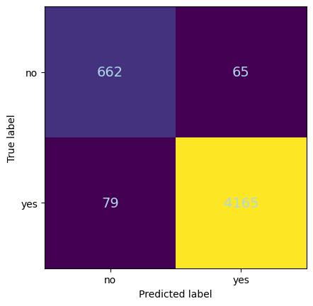
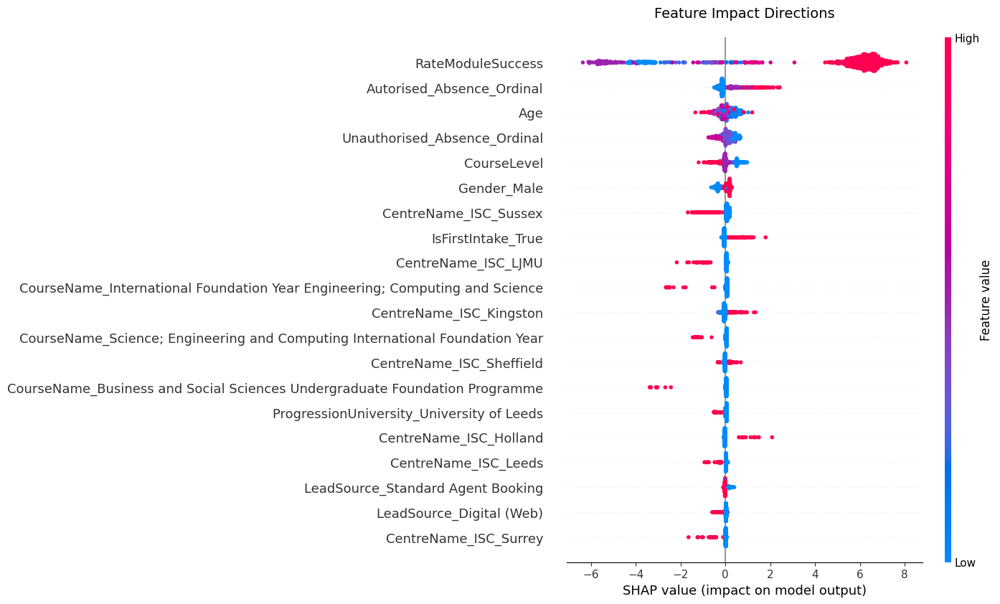

## Overview

In this project, I applied supervised learning techniques to perform predictions using progressive dataset refinement, feature engineering, hyperparameter tuning, and XGBoost gradient-boosted decision trees. The analysis demonstrated XGBoost's strong predictive performance on structured data.
This work was completed as part of a Professional Certificate in Data Science with Machine Learning and AI from the University of Cambridge. Due to confidentiality requirements, I cannot share the dataset or complete project details, but I present the methodology and selected results that showcase the techniques learned during the course.

## Approach

All work in this project was implemented in Python 3.12.3. Datasets underwent preprocessing and EDA using pandas (v2.2.3). Irrelevant columns and high cardinality features were removed. "Date of Birth" was transformed into "Age." Columns with >50% missing data were dropped. Ordinal encoding was applied to the column with ordinal data using scikit-learn (v1.6.1) (Pedregosa et al., 2011). Absence counts were binned into categories. One-hot encoding was used for other categorical features. Missing values were addressed by removing observations when the fraction of NAs was below 2%. When needed, feature engineering techniques were applied to create new features that provided additional insights. NumPy (v1.26.4) was used for numerical computations.

### Dataset Progression

The original work was performed using a progressive approach, where the dataset was successively enriched to evaluate how additional information impacts model performance:

1. **Stage 1**: Core student profiles
2. **Stage 2**: Engagement metrics were added to the dataset.
3. **Stage 3**: Academic performance metrics were added to the dataset.

Here I show only some of the relevant steps and results from Stage 3, for demonstration purposes.

### Methodology

- **Preprocessing**: Following an initial EDA phase to better understand the dataset, data encoding, scaling, and feature engineering were performed. Specific steps included:
    - Remove columns not useful in the analysis.
    - Remove columns with high cardinality (use >200 unique values, as a guideline for this data set).
    - Remove columns with >50% missing values.
    - Perform ordinal encoding for ordinal data.
    - Perform one-hot encoding for all other categorical data.
    - Choose how to engage with rows that have missing values, which can be done in one of two ways for this project:
      *   Impute the rows with appropriate values.
      *   Remove rows with missing values but ONLY in cases where rows with missing values are minimal: <2% of the overall data.
- **Model**: XGBoost with hyperparameter tuning
- **Evaluation**: ROC-AUC, F1-score, precision-recall metrics
- **Comparison**: Performance analysis across all three data stages


## Results

For simplicity, only selected sections of the stage 3 analysis and results are shown as examples. A detailed performance comparison for the XGBoost models across all stages is provided in the table below.


```{python}
#| echo: false
#| label: tbl-xgb_comp
#| code-fold: true
#| code-summary: "Load and display XGBoost performance data"
#| tbl-cap: 'XGBoost Model Performance before and after hyperparameter tuning: Class 0 denotes the minority class, the less prevalent category in this imbalanced dataset. Performance optimization for the minority class is critical since accurately predicting underrepresented cases typically constitutes the core analytical objective, despite their lower frequency in the training data.'
#| tbl-cap-location: bottom
#| output: asis

import pandas as pd
# Load and display data (path relative to project root)
xgb_s1s2s3 = pd.read_csv('../assets/student_dropout/figures/full_comparison_XGB_s1s2s3.csv')

# Define the decimal precision
decimal_places = 3
# Format numeric columns
numeric_cols = xgb_s1s2s3.select_dtypes(include=['float64', 'int64']).columns
xgb_s1s2s3[numeric_cols] = xgb_s1s2s3[numeric_cols].round(decimal_places)

# Print as markdown table with improved formatting
print(xgb_s1s2s3.to_markdown(tablefmt="pipe", index=False, stralign="center", numalign="center"))

```


### XGBoost Model Development: 

XGBoost (v3.0.1) models were initially trained without tuning (Chen & Guestrin, 2016). Hyperparameter tuning used GridSearchCV with 3-fold cross-validation, optimizing for ROC AUC. Key hyperparameters included learning_rate, max_depth, and n_estimators. 

Feature matrices (X) were constructed by isolating the target variable (y) from the dataset. An 80-20 train-test split was then applied to partition the data. To validate the split's quality, I examined the target variable distribution in both subsets, confirming similar class proportions, an essential verification step when working with imbalanced data. Although normalization was performed to facilitate this distributional analysis, the original unnormalized features were retained for XGBoost modeling, as tree-based algorithms do not benefit from feature scaling.


```{python}
#| echo: true
#| eval: false
#| code-fold: false
#| code-overflow: wrap

# Split the data into features and target variable
X_s3 = df3_filled.drop(columns=['CompletedCourse_Yes'], axis=1, inplace=False)
y_s3 = df3_filled['CompletedCourse_Yes'] 

# Split the data into training and validation sets
X_train_s3, X_val_s3, y_train_s3, y_val_s3 = train_test_split(X_s3, y_s3, test_size=0.2, random_state=42)
# Split the training data into training and test sets
X_train_s3, X_test_s3, y_train_s3, y_test_s3 = train_test_split(X_train_s3, y_train_s3, test_size=0.2, random_state=42)

# Display the shapes of the training, validation, and test sets
print("Training set shape:", X_train_s3.shape, y_train_s3.shape)
print("Validation set shape:", X_val_s3.shape, y_val_s3.shape)
print("Test set shape:", X_test_s3.shape, y_test_s3.shape)

# Check the distribution of the target variable in the training set
print("Training set target variable distribution:")
print(y_train_s3.value_counts(normalize=True))

# Check the distribution of the target variable in the validation set
print("Validation set target variable distribution:")
print(y_val_s3.value_counts(normalize=True))

# Check the distribution of the target variable in the test set
print("Test set target variable distribution:")
print(y_test_s3.value_counts(normalize=True))
```

### Baseline Model without Hyperparameter Tuning

Following the data split, a baseline XGBoost model was trained using default hyperparameters. The model's performance was evaluated on the validation set using accuracy and a classification report, which includes precision, recall, and F1-score. A confusion matrix was plotted to visualize the model's predictions. Feature importance was also examined to identify the most influential features in the model.


```{python}
#| echo: true
#| eval: false
#| code-fold: false
#| code-overflow: wrap
xg_model_no_tunning_s3 = xgb.XGBClassifier(random_state=42)
xg_model_no_tunning_s3.fit(X_train_s3, y_train_s3)
```


```{python}
#| echo: true
#| eval: false

# Model evaluation
predictions_no_tunning_s3 = xg_model_no_tunning_s3.predict(X_val_s3)
# Calculate accuracy
accuracy = accuracy_score(y_val_s3, predictions_no_tunning_s3)
# Get classification report as dictionary
report = classification_report(y_val_s3, predictions_no_tunning_s3, output_dict=True)
# Convert to DataFrame
report_df = pd.DataFrame(report).transpose()
# Format the DataFrame
report_df = report_df.round(4)
# Add accuracy as a separate display
print(f"XGBoost Model Accuracy: {accuracy}\n")
# Display the classification report as a formatted table
display(report_df.style.format("{:.4f}"))

```
**XGBoost Model Accuracy:  0.9710319855159928**
```{python}
#| echo: false
#| label: tbl-xgb_classif_no_tunning
#| code-fold: true
#| code-summary: "Load and display XGBoost performance data"
#| tbl-cap: 'XGBoost Model Performance before hyperparameter tuning.'
#| tbl-cap-location: bottom
#| output: asis

import pandas as pd
# Load and display data (path relative to project root)
xgb_class_no_tunning = pd.read_csv('../assets/student_dropout/figures/xgboost_classification_report_no_tuning.csv')

# Define the decimal precision
decimal_places = 3
# Format numeric columns
numeric_cols = xgb_class_no_tunning.select_dtypes(include=['float64', 'int64']).columns
xgb_class_no_tunning[numeric_cols] = xgb_class_no_tunning[numeric_cols].round(decimal_places)

# Print as markdown table with improved formatting
print(xgb_class_no_tunning.to_markdown(tablefmt="pipe", index=False, stralign="center", numalign="center"))

```

Figure 1A displays the confusion matrix for the baseline XGBoost model trained on Stage 3 data (demographics, engagement, and academic performance). The matrix visualizes model predictions on the validation set, comparing predicted dropout outcomes against actual student outcomes. The diagonal elements represent correct classifications: students correctly identified as completing or dropping out. Off-diagonal elements show misclassifications. The model demonstrates strong performance with minimal false negatives (missed dropout cases) and false positives (incorrectly flagged completers), achieving 97.1% accuracy (Table 2). This visualization is critical for evaluating the model's ability to identify at-risk students requiring early intervention support. 

Figure 1B presents the feature importance analysis for the baseline XGBoost model, ranking the top 20 features by their contribution to dropout prediction. The visualization quantifies each feature's impact on model decisions, with longer bars indicating greater importance. Academic performance emerged as the most influential predictor. Engagement metrics like absence patterns and demographic factors such as age also demonstrated significant predictive power. This ranking reveals that academic achievement data provides the strongest signals for identifying at-risk students.

```{=html}
<figure id="fig-baseline-model" class="fig-panel">
  <div class="fig-row" style="gap:5%; justify-content: flex-start;">
    <!-- Figure A: Confusion Matrix -->
    <div style="flex: 0 0 35%; align-self: center;">
      <div class="fig-label" style="font-size: 20pt; font-weight: normal; margin-bottom: 0.3em; color: #2c3e50; text-align: left;">A: Confusion Matrix</div>
      <div style="text-align: center;">
        
        
      </div>
    
    </div>
    <!-- Figure B: Feature Importance -->
    <div style="flex: 0 0 55%; text-align: center;">
      <div class="fig-label" style="font-size: 20pt; font-weight: normal; margin-bottom: 0.3em; text-align: left; color: #2c3e50;">B: Feature Importance</div>
      
      
    </div>
  </div>
  <figcaption class="fig-caption">
    Figure 1: Baseline XGBoost model performance on validation set: (A) Confusion matrix showing classification accuracy for dropout prediction, (B) Top 20 most important features ranked by their contribution to model predictions.
  </figcaption>
</figure>
```
Fine tunning of hyperparameters was performed to optimize model performance. A grid search approach evaluated combinations of learning_rate, max_depth, min_child_weight, gamma, subsample, colsample_bytree, and n_estimators. The search used 3-fold cross-validation on the training set, optimizing for ROC AUC to balance sensitivity and specificity in this imbalanced dataset. The best hyperparameter combination was selected based on cross-validated performance.


### Hyperparameter Tuning with GridSearchCV
```{python}
#| echo: true
#| eval: false
#| code-fold: false
#| code-overflow: wrap
# Grid Search for Hyperparameter Tuning

param_grid = {
    'learning_rate': [0.01, 0.05, 0.1],      # Lower for better generalization
    'max_depth': [4, 6, 8],                   # Control tree complexity
    'min_child_weight': [1, 3, 5],            # Prevent overfitting
    'gamma': [0, 0.1, 0.2],                   # Regularization
    'subsample': [0.6, 0.8, 1.0],             # Stochastic sampling
    'colsample_bytree': [0.6, 0.8, 1.0],      # Feature sampling
    'n_estimators': [50, 100, 150]            # Number of trees
}

grid_search = GridSearchCV(
    estimator=xgb.XGBClassifier(
        eval_metric='logloss',
        early_stopping_rounds=10,
        random_state=42
    ),
    param_grid=param_grid,
    scoring='roc_auc',  # Optimize for AUC
    cv=3,               # 3-fold cross-validation
    n_jobs=-1           # Use all CPU cores
)

grid_search.fit(X_train_s3, y_train_s3, eval_set=[(X_val_s3, y_val_s3)], verbose=False)
best_params_s3 = grid_search.best_params_
```

Subsequently, the XGBoost model was retrained using the optimal hyperparameters identified through grid search. The model's performance was re-evaluated on the validation set, with accuracy, a classification report, and a confusion matrix generated to assess improvements.

### Initialise model with best parameters
```{python}
#| echo: true
#| eval: false
#| code-fold: false
#| code-overflow: wrap
# Initialize model with optimized hyperparameters
xg_model_best_param_s3 = xgb.XGBClassifier(
    random_state=42,
    n_estimators=100,           # Number of boosting rounds
    max_depth=6,                # Tree depth
    learning_rate=0.1,          # Shrinkage factor
    subsample=0.8,              # % of samples per tree
    colsample_bytree=0.6,       # % of features per tree
    eval_metric='logloss',      # Metric for early stopping
    early_stopping_rounds=10,   # Stop if no improvement
    min_child_weight=1,        # Prevent overfitting
    gamma=0.1                  # Regularization
)

# Train with validation monitoring
xg_model_best_param_s3.fit(
    X_train_s3, y_train_s3,
    eval_set=[(X_val_s3, y_val_s3)],  # Early stopping data
    verbose=False                # Show training progress
)
```

```{python}
#| echo: true
#| eval: false

# Model evaluation
predictions_best_param_s3 = xg_model_best_param_s3.predict(X_val_s3)
# Calculate accuracy
accuracy_best_param_s3 = accuracy_score(y_val_s3, predictions_best_param_s3)
# Get classification report as dictionary
report_df_best_param_s3 = classification_report(y_val_s3, predictions_best_param_s3, output_dict=True)
# Convert to DataFrame
report_df_best_param_s3 = pd.DataFrame(report_df_best_param_s3).transpose()
# Format the DataFrame
report_df_best_param_s3 = report_df_best_param_s3.round(4)
# Reset index to make it a column with empty name
report_df_best_param_s3 = report_df_best_param_s3.reset_index()
report_df_best_param_s3.rename(columns={'index': ''}, inplace=True)

# Save to CSV
report_df_best_param_s3.to_csv('assets/student_dropout/figures/xgboost_classification_report_best_param.csv', index=False)


# Add accuracy as a separate display
print(f"XGBoost Model Accuracy: {accuracy_best_param_s3}\n")

# Display the classification report as a formatted table
# Format only numeric columns, leave the first column (class names) as-is
display(report_df_best_param_s3.style.format({
    'precision': '{:.4f}',
    'recall': '{:.4f}',
    'f1-score': '{:.4f}',
    'support': '{:.0f}'
}, na_rep=''))

```
**XGBoost Model Best Params Accuracy:  0.9712331522832428**
```{python}
#| echo: false
#| eval: true
#| label: tbl-xgb_classif_best_param_s3
#| code-fold: true
#| code-summary: "Load and display XGBoost performance data"
#| tbl-cap: 'XGBoost Model Performance after hyperparameter tuning.'
#| tbl-cap-location: bottom
#| output: asis

import pandas as pd
# Load and display data (path relative to project root)
xgb_class_best_param_s3 = pd.read_csv('../assets/student_dropout/figures/xgboost_classification_report_best_param.csv')

# Define the decimal precision
decimal_places = 3
# Format numeric columns
numeric_cols = xgb_class_best_param_s3.select_dtypes(include=['float64', 'int64']).columns
xgb_class_best_param_s3[numeric_cols] = xgb_class_best_param_s3[numeric_cols].round(decimal_places)

# Print as markdown table with improved formatting
print(xgb_class_best_param_s3.to_markdown(tablefmt="pipe", index=False, stralign="center", numalign="center"))

```


```{=html}
<figure id="fig-base-vs-tuned-model" class="fig-panel">
  <div class="fig-row" style="gap:5%; justify-content: flex-start;">
    <!-- Figure A: Confusion Matrix -->
    <div style="flex: 0 0 55%; align-self: center;">
      <div class="fig-label" style="font-size: 20pt; font-weight: normal; margin-bottom: 0.3em; color: #2c3e50; text-align: center;">Confusion Matrix</div>
      <div style="text-align: center;">
        
        
      </div>
      
    </div>
  </div>
  <figcaption class="fig-caption">
    Figure 2: Performance comparison of baseline and hyperparameter-tuned XGBoost models on the validation set.  
  </figcaption>
</figure>
```

Both confusion matrices demonstrate strong classification accuracy, with the tuned model (right, ROC-AUC=0.9942) showing marginal improvement over the baseline model (left, ROC-AUC=0.9928) (Figure 2). The minimal difference suggests that with Stage 3's comprehensive feature set, model architecture has less impact than data quality and feature engineering (Not shown in this report). Both models exhibit excellent performance in identifying at-risk students (Class 0) while maintaining high accuracy for course completers (Class 1).

### Model Interpretability with SHAP Values

To enhance model interpretability, SHAP (SHapley Additive exPlanations) values were computed for both the baseline and tuned XGBoost models. Here I show only an example for the the fine tuned model (Figures 3). SHAP values quantify each feature's contribution to individual predictions, providing insights into model decision-making.

```{python}
#| echo: true
#| eval: false
#| code-fold: false
#| code-overflow: wrap

def shap_analysis(model, X, sample_size=1000, random_state=42):
    """Compute SHAP values with robust sampling and checks."""
    if len(X) == 0:
        raise ValueError("Input X is empty")
    
    explainer = shap.TreeExplainer(model)
    sample_size = min(max(sample_size, 10), len(X))  # Clamp sample_size
    
    if isinstance(X, pd.DataFrame):
        X_sample = X.sample(n=sample_size, random_state=random_state)
    else:
        X_sample = X[np.random.choice(len(X), size=sample_size, replace=False)]
    
    shap_values = explainer(X_sample)
    return shap_values, X_sample, explainer.expected_value

# Usage 
shap_values_base_s3, X_sample_base_s3, expected_value_base_s3 = shap_analysis(xg_model_no_tunning_s3, X_train_s3)
```

```{python}
#| echo: true
#| eval: false
#| code-fold: false
#| code-overflow: wrap
# Get SHAP values (unpack ALL return values)
shap_values_best_param_s3, X_sample_best_param_s3, expected_value_best_param_s3 = shap_analysis(
    xg_model_best_param_s3, 
    X_train_s3, 
    sample_size=1000, 
    random_state=42
)

# --------------------------------------------------
# 1. Feature Impact Directions (Beeswarm Plot)
# --------------------------------------------------
plt.close('all')  # Clear previous plots
shap.summary_plot(
    shap_values_base_s3,  # Use full Explanation object
    X_sample_base_s3,     # Sampled features
    show=False
)
plt.title("Feature Impact Directions", fontsize=14, pad=20)
plt.tight_layout()
plt.show()

```


```{=html}
<figure id="fig-feature-impact-tuned-model" class="fig-panel">
  <div class="fig-row" style="gap:5%; justify-content: flex-start;">
    <!-- Figure A: Confusion Matrix -->
    <div style="flex: 0 0 55%; align-self: center;">
      <div class="fig-label" style="font-size: 20pt; font-weight: normal; margin-bottom: 0.3em; color: #2c3e50; text-align: center;">Feature Impact for Fine Tuned XGBoost Model</div>
      <div style="text-align: center;">
        
        
      </div>
      
    </div>
  </div>
  <figcaption class="fig-caption">
    Figure 3: Beeswarm plot showing how individual feature values influence dropout predictions across 1,000 sampled students.  
  </figcaption>
</figure>
```
The beeswarm plot visualizes SHAP value distributions for the top features in the tuned XGBoost model. Each dot represents one student from the 1,000-student sample, positioned horizontally according to its SHAP value (impact on prediction). Color coding reveals the underlying feature values: red indicates high values, blue indicates low values.
RateModuleSuccess dominates the visualization with the widest horizontal spread, demonstrating its overwhelming influence on predictions. The clear separation between blue dots (negative SHAP values, indicating lower success rates) and red dots (positive SHAP values, indicating higher success rates) confirms that strong academic performance reduces dropout risk while poor performance increases it.
In contrast, secondary features like Age and absence metrics show compressed distributions, indicating substantially less predictive influence despite their prominence in the model. This discrepancy is particularly noteworthy: while the feature importance plot in Figure 1B identifies Age as a top feature, the beeswarm plot reveals its actual impact on individual predictions is limited compared to RateModuleSuccess.
Overall, the beeswarm plot demonstrates that academic performance is the primary driver of dropout predictions. This finding aligns with observations from the progressive data enrichment phase, where including academic performance metrics proved more valuable than hyperparameter tuning or other model refinements.


## Conclusions and Reflections

This project used a systematic approach to making predictions about student dropout risk through progressive dataset enrichment and XGBoost modeling. The analysis revealed several critical insights about feature engineering, model optimization, and the practical considerations for deploying predictive systems in educational settings.

The progressive enrichment strategy proved highly effective across three stages of data integration. Stage 1 models, utilizing only demographic information, achieved modest performance (not shown). The addition of engagement metrics in Stage 2 marked a meaningful improvement, elevating discrimination to 0.89 (Table 1). The most dramatic performance leap occurred in Stage 3 with the introduction of the RateModuleSuccess feature, calculated as (PassedModules - FailedModules) / AssessedModules. This single engineered feature propelled model performance to 0.993-0.994 ROC-AUC, demonstrating that thoughtful feature construction can outweigh extensive algorithmic refinements.

The comparative analysis between baseline and hyperparameter-tuned models revealed an important finding: feature engineering substantially outweighed hyperparameter optimization in impact. While GridSearchCV optimization across learning rate, tree depth, regularization parameters, and ensemble size yielded improvements, the gains were marginal (0.001 ROC-AUC increase in Stage 3)(Figure 3). In contrast, the RateModuleSuccess feature alone drove a 0.10+ improvement over Stage 2 performance. SHAP analysis confirmed this dominance, revealing that RateModuleSuccess's impact magnitude exceeded all other predictors by an order of magnitude. This pattern suggests that in structured educational datasets, investing effort in domain-informed feature construction provides greater returns than exhaustive hyperparameter searches.

The models successfully addressed class imbalance challenges through strategic feature selection rather than resampling techniques. Both baseline and tuned Stage 3 models maintained high precision (0.97-0.98) and recall (0.93-0.94) for the minority dropout class, demonstrating practical utility for early intervention systems. The confusion matrices revealed minimal false negatives—critical for ensuring at-risk students receive necessary support—while maintaining low false positive rates to avoid intervention fatigue.

SHAP interpretability analysis provided valuable insights into model decision-making. The beeswarm plots revealed that while multiple features contributed to predictions, academic performance metrics dominated the decision space. Secondary features like age and absence patterns provided marginal adjustments but rarely overrode the signal from academic success rates. This finding aligns with educational theory but raises important questions about temporal validity and practical deployment.

A significant limitation emerged regarding the RateModuleSuccess feature's strong correlation with the target variable. While this correlation drives excellent predictive performance, it raises concerns about temporal availability and true predictive power. This feature may not be accessible early enough in a student's academic journey for truly proactive intervention, by the time failing grades accumulate, dropout risk may already be actualized. Future work should explore feature availability timelines, validating model performance using only data accessible at enrollment or within the first academic term. Additionally, investigating lagged features and time-series approaches could enable earlier risk detection while maintaining predictive accuracy. Testing model generalization across different institutions, academic programs, and temporal periods would establish practical deployment feasibility for real-world early warning systems.


## References

1. Chen, T., & Guestrin, C. (2016). XGBoost: A Scalable Tree Boosting System. In Proceedings of the 22nd ACM SIGKDD International Conference on Knowledge Discovery and Data Mining (pp. 785-794). 

2. LeCun, Y., Bengio, Y., & Hinton, G. (2015). Deep learning. Nature, 521(7553), 436-444. 

3. GitHub Repository: XGBoost - The official source for the XGBoost library, which includes installation instructions, documentation, and examples to get started.

4. Pedregosa, F., Varoquaux, G., Gramfort, A., Michel, V., Thirion, B., Grisel, O., ... & Duchesnay, É. (2011). Scikit-learn: Machine Learning in Python. Journal of Machine Learning Research, 12, 2825-2830. This paper describes the design and usage of scikit-learn for implementing machine learning algorithms in Python, emphasizing its usability and performance

5. Official Documentation: scikit-learn - Comprehensive documentation including tutorials, user guides, and the API reference for all the features provided by scikit-learn.

6. Official Documentation: TensorFlow - The primary resource for TensorFlow, offering guides, tutorials, and API references for building machine learning and neural network models.

7. Official Documentation: Keras - This documentation serves as a valuable resource for understanding how to utilize Keras for deep learning, including multiple APIs and support for various backends.


[← Back to Projects](../projects.qmd){.back-link}